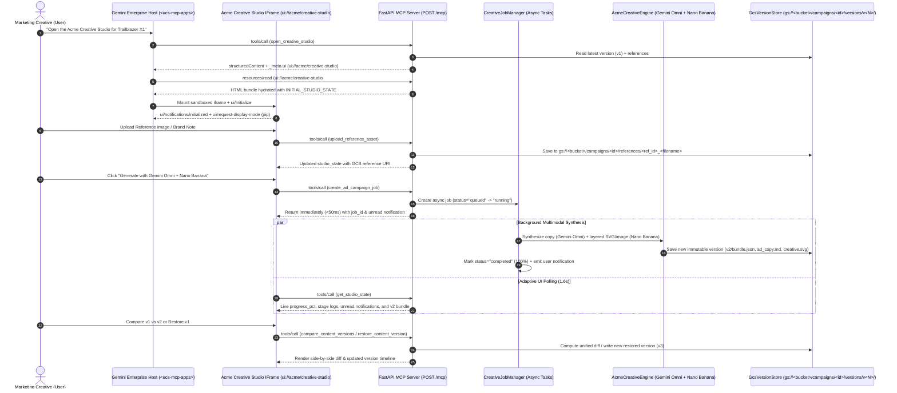

# Acme Inc. Creative Studio — Gemini Enterprise MCP App (`ui://acme/creative-studio`)

An interactive **Gemini Enterprise MCP App** built for **Acme Inc.** in the **Demo Factory** (`demos/demo-factory/demos/acme-creative-studio-mcp`). Users interactively create, edit, and version multimodal ad copy and visual creatives powered by **Gemini Omni** (`gemini-omni-flash-preview`) and **Nano Banana** (`gemini-3.1-flash-image-preview`), grounded on uploaded reference images/content, with live async backend job tracking and **Google Cloud Storage (GCS)** content version control.

---

## 1. Key Architectural Patterns & Findings from the Cooley Law MCP App (`demos/ge-mcp-app-demo`)

This project applies all 10 production findings discovered while connecting the Cooley Law Motion-to-Seal (MTS) MCP App to Gemini Enterprise:

| # | Pattern / Finding from Cooley Law Demo | How It Is Applied in Acme Inc. Creative Studio |
|---|---|---|
| 1 | **Streamable HTTP JSON-RPC 2.0 (`POST /mcp`)** | Hand-rolled dispatcher in `app/mcp_server.py` (`POST /mcp` -> `200 application/json`, `DELETE /mcp` -> `204`, `GET /mcp` -> `405`) avoiding FastMCP SSE framing mismatches. |
| 2 | **Multi-Dialect `_meta.ui` & URI Fragment Normalization** | Emits `_meta.ui`, `_meta["io.modelcontextprotocol/ui"]`, and `_meta["ui/resourceUri"]` pointing to `ui://acme/creative-studio` with `preferredMode: "pip"`, and strips `#...` / `?` nonces appended by `<ucs-mcp-apps>` on `resources/read`. |
| 3 | **Dolphin / AgentFlow Tool Name Prefix Stripping** | Automatically strips `custom_mcp_<connector_id>_agent__` prefixes via `raw_name.rsplit("__", 1)[-1]` in `tools/call`. |
| 4 | **Dual `initialized` PostMessage Handshake** | Widget immediately sends both `ui/notifications/initialized` and `notifications/initialized` after `ui/initialize` so Gemini Enterprise's loading overlay clears immediately. |
| 5 | **Atomic DOM Reparenting (`moveElement()`) & Zero-Reload PiP/Fullscreen** | Widget requests `ui/request-display-mode` (`pip` / `fullscreen`) and maintains all state in-memory inside the single-file HTML bundle (`templates/acme_creative_studio.html`). |
| 6 | **Serialized Framed RPC Queue (`toolCallChain` + 120ms Cooldown)** | Prevents concurrent `tools/call` postMessages from colliding with Gemini Enterprise's `WidgetExecuteUiWidgetAction` session teardown (`DELETE /mcp`). |
| 7 | **Async Non-Blocking Tool Execution (`< 2s` Turn-1 Response)** | `create_ad_campaign_job` spawns a background `asyncio.Task` (`CreativeJobManager`) and returns `status: "running"` in `< 50ms` so GE's 30–60s gateway never times out. |
| 8 | **Live Progress Polling & User Notification Queue** | Widget polls `get_studio_state` (`visibility: ["app"]`) every 1.6s while a job is active, rendering stage progress (`0% -> 100%`) and toast notifications (`acknowledge_job_notification`). |
| 9 | **Sandboxed IFrame Download Token Pattern (`/download/{token}`)** | Because `gstatic.com` guest iframes block `<a download="blob:...">`, GCS artifacts (`ad_copy.md`, `creative.svg`, `bundle.json`) are served via signed `/download/{token}` URLs opened via `ui/open-link`. |
| 10 | **Anti-`canvas_agent` Guardrail & Golden Cloud Run Flags** | Agent instructions explicitly forbid `canvas_agent`, and `scripts/deploy_cloudrun.sh` sets `--no-cpu-throttling --min-instances 1 --max-instances 1 --concurrency 80`. |

---

## 2. System Architecture



---

## 3. MCP Tools Exposed (`POST /mcp`)

| Tool Name | Visibility | Description |
|---|---|---|
| `open_creative_studio` | `["model", "app"]` | Opens the interactive Creative Studio widget (`ui://acme/creative-studio`) hydrated with active campaign, references, jobs, and GCS versions. |
| `create_ad_campaign_job` | `["model", "app"]` | Launches an async background job running **Gemini Omni** + **Nano Banana** grounded in uploaded references, saving a new version to GCS. |
| `refine_ad_copy_job` | `["model", "app"]` | Saves interactive headline, subheadline, body copy, CTA, or visual prompt edits as a new immutable GCS version (`v<N>`). |
| `upload_reference_asset` | `["model", "app"]` | Uploads a reference image (`data:image/...` or base64) or brand brief document to `gs://<bucket>/campaigns/<id>/references/`. |
| `list_active_jobs` | `["model", "app"]` | Lists active (`queued`, `running`) and recent (`completed`, `failed`) jobs and unread user notifications. |
| `get_job_status` | `["model", "app"]` | Returns detailed progress percentage (`0–100%`), stage logs, and resulting GCS version metadata for a `job_id`. |
| `acknowledge_job_notification` | `["app"]` | Dismisses unread job completion/start notifications in the studio toast bar. |
| `get_studio_state` | `["app"]` | Lightweight polling endpoint returning current campaign, active version, jobs, notifications, references, and version history. |
| `list_content_versions` | `["model", "app"]` | Lists all saved versions (`v1`, `v2`, `v3`, ...) in the GCS bucket for a campaign. |
| `get_content_version` | `["model", "app"]` | Loads a specific historical version (`v<N>`) from GCS into the studio canvas. |
| `compare_content_versions` | `["model", "app"]` | Computes field-by-field changes and a unified Markdown diff between two GCS versions (`version_a` vs `version_b`). |
| `restore_content_version` | `["model", "app"]` | Restores a historical GCS version (`v<N>`) by promoting it to a new latest immutable version (`v<M>`). |

---

## 4. Local Quickstart & Verification

```bash
cd demos/demo-factory/demos/acme-creative-studio-mcp

# 1. Run unit & integration test suite
pytest -v

# 2. Run Demo Factory evaluation suite (>= 0.85 threshold)
python3 -m app.eval_runner

# 3. Start the Creative Studio server locally
uvicorn app.main:app --host 0.0.0.0 --port 8080 --reload
```

Then open **`http://localhost:8080/app`** in your browser to use the standalone Creative Studio UI, or point Gemini Enterprise's Custom MCP Server connector to **`https://<cloud-run-service>/mcp`**.

---

## 5. Credential & Environment Configuration

Copy `.env.example` to `.env` (never commit `.env`):

```bash
cp .env.example .env
gcloud auth application-default login
```

Key environment variables:
- `GCP_PROJECT=truiz-agy-demo`
- `GCP_LOCATION=global`
- `GEMINI_OMNI_MODEL=gemini-omni-flash-preview`
- `NANO_BANANA_MODEL=gemini-3.1-flash-image-preview`
- `GCS_CREATIVE_BUCKET=truiz-agy-demo-acme-creative-studio-assets`
- `DISABLE_LIVE_GCS=0` (set to `1` for offline local testing using `.gcs_local_mirror/`)
