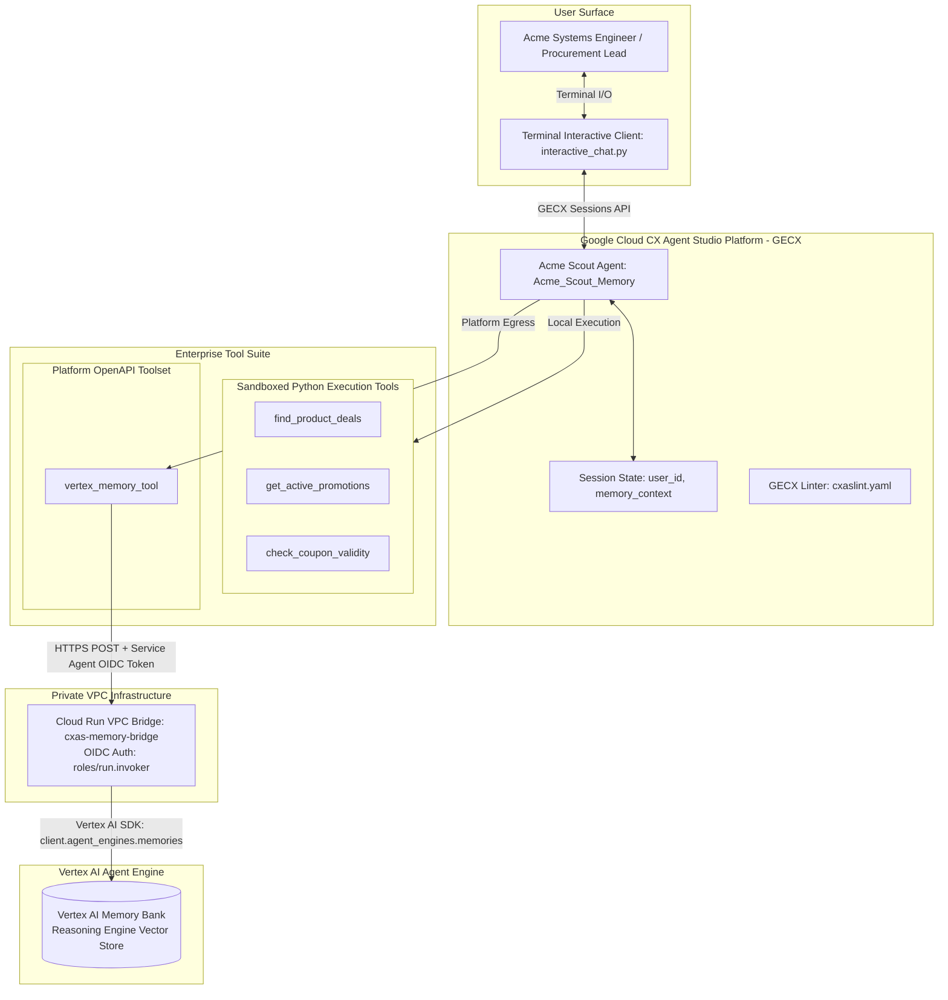
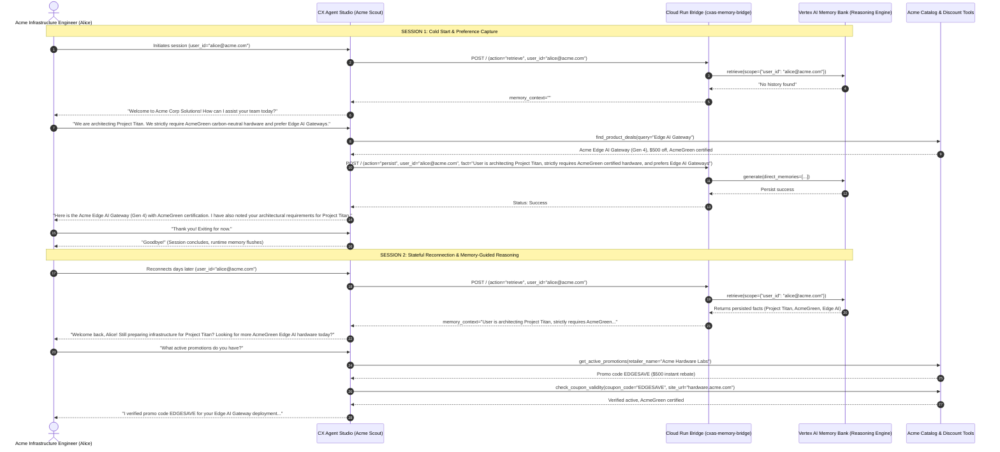

# 🏭 Acme Corp Solutions Scout with Vertex AI Memory Bank

> **Stateful Enterprise Conversational Agent Pattern for Google Cloud CX Agent Studio (GECX / CXAS)**  
> Demonstrating persistent, cross-session user memory, private VPC routing, and autonomous preference-guided reasoning.

---

## 🏛️ Executive Summary & Value Proposition

In enterprise customer engagement, procurement, and field architecture workflows, standard conversational agents are **ephemeral**—session parameters and contextual dialogue history are discarded when a session concludes. When a customer, systems engineer, or procurement director returns days later, they are forced to re-introduce themselves, restate architectural constraints, and restart discovery from scratch.

This demonstration package implements the **Stateful GECX Agent Pattern** for fictitious enterprise customer **Acme Corp**.

By pairing **Google Cloud CX Agent Studio (GECX)** with **Vertex AI Agent Engine Memory Banks (Reasoning Engine)** via a private **Cloud Run VPC Bridge**, the Acme Scout agent achieves:
1. **Persistent VIP Treatment**: Immediately greets returning users by name and acknowledges ongoing initiatives (e.g., *Project Titan*, *Edge AI Deployments*).
2. **Autonomous Memory-Guided Reasoning**: Proactively personalizes catalog search queries without requiring users to re-specify constraints (e.g., searching for "servers" automatically filters for carbon-neutral **AcmeGreen** certified hardware).
3. **Zero-Trust Network Isolation**: Keeps sensitive user facts and procurement telemetry off the public internet by authenticating GECX requests using Google Service Agent ID tokens over internal VPC routing.
4. **Blended Hybrid Tools Topology**: Seamlessly orchestrates platform OpenAPI Toolsets alongside local sandboxed Python function tools.

---

## 📐 Architecture & Data Flow



---

## 🔄 Sequence Diagram: Two-Session Stateful Walkthrough



---

## 📁 Repository Structure

```
acme-scout-memory-demo/
├── README.md                      # Detailed architectural and operational guide
├── pyproject.toml                 # Package and dependency configuration
├── requirements.txt               # Staging dependencies
├── .env.example                   # Environment variable template
├── .gitignore                     # Git tracking exclusions
├── deploy_bridge.sh               # Cloud Run VPC Bridge deployment script
├── interactive_chat.py            # Terminal interactive multi-session chat runner
├── cxas-memory-bridge/            # Cloud Run Memory Bridge source
│   ├── Dockerfile                 # Container packaging
│   ├── main.py                    # Flask service wrapping Vertex AI Agent Engine SDK
│   └── requirements.txt           # Bridge microservice dependencies
└── cxas_app/                      # GECX application package
    ├── app.json                   # Manifest with user_id & memory_context state declarations
    ├── environment.json           # Audio recording and evaluation logging config
    ├── cxaslint.yaml              # GECX linting exception rules
    ├── agents/
    │   └── Acme_Scout_Memory/
    │       ├── Acme_Scout_Memory.json   # Agent declaration, tools, and toolsets
    │       └── instruction.txt          # GECX XML taskflow (<role>, <persona>, <guidelines>, <taskflow>)
    ├── tools/                     # Local sandboxed Python tools
    │   ├── find_product_deals/          # Acme Cloud, Edge AI, Industrial IoT catalog deals
    │   ├── get_active_promotions/       # Corporate discount codes (ACMECLOUD25, EDGESAVE, BULKIOT)
    │   └── check_coupon_validity/       # Real-time promo code & AcmeGreen sustainability checks
    └── toolsets/
        └── vertex_memory_tool/          # OpenAPI 3.0 toolset routing to cxas-memory-bridge
            ├── vertex_memory_tool.json
            └── open_api_toolset/
                └── open_api_schema.yaml
```

---

## 🛠️ Step-by-Step Deployment & Operational Guide

### 1. Prerequisites
- Google Cloud Project with billing enabled (e.g. `truiz-cx-agent-studio`).
- `gcloud` CLI installed and authenticated (`gcloud auth application-default login`).
- Python 3.11+ virtual environment with `cxas-scrapi` installed.

### 2. (Optional) Deploy Cloud Run Memory Bridge
If deploying to a new GCP project or region, execute the deployment automation script:
```bash
./deploy_bridge.sh
```
The script will:
1. Enable `aiplatform.googleapis.com`, `run.googleapis.com`, and `iam.googleapis.com`.
2. Build and deploy `cxas-memory-bridge` to Cloud Run.
3. Automatically update `open_api_schema.yaml` with the generated Cloud Run URL.
4. Grant `roles/run.invoker` to the GECX Service Agent (`service-<PROJECT_NUMBER>@gcp-sa-ces.iam.gserviceaccount.com`).

*(Note: In the pre-configured environment, the bridge is already live at `https://cxas-memory-bridge-837107868437.us-central1.run.app`)*.

### 3. Validate App with GECX Linter
Run `cxas lint` to verify all proto schemas, tool functions, and XML instructions:
```bash
cxas lint --app-dir cxas_app
```
**Output:**
```
Linting app: cxas_app
============================================================
  Agents: 1
  Tools: 3
  Callbacks: 0
  Evals: 0
============================================================
LINT RESULTS
============================================================
  All checks passed.
Lint PASSED (no errors).
```

### 4. Deploy / Push to GECX
Push the application directly to your target GECX App instance:
```bash
cxas push --app-dir cxas_app --to projects/truiz-cx-agent-studio/locations/us/apps/[YOUR_ACME_APP_ID]
```

### 5. Run Interactive Multi-Session Verification
Launch the terminal chat client to test multi-session memory:
```bash
python interactive_chat.py [YOUR_ACME_APP_ID]
```

---

## 🧪 Real-World Demonstration Script

### **Session 1: Initial Discovery & Preference Capture**
```text
$ python interactive_chat.py [APP_ID]
Connecting to deployed Acme GECX Agent:
  projects/truiz-cx-agent-studio/locations/us/apps/[APP_ID]

Enter your Enterprise User ID / Email: alice@acme.com
Session established for User ID: 'alice@acme.com'
------------------------------------------------------------------

You: Hi, I need help evaluating hardware for our infrastructure team.
Acme Scout: Welcome to Acme Corp Solutions! I would be delighted to assist your team. What specific infrastructure workloads or deployment specs are you exploring today?

You: We are architecting Project Titan. We strictly require AcmeGreen carbon-neutral hardware and prefer Edge AI Gateways.
Acme Scout: [Calls find_product_deals(query="Edge AI Gateway")]
[Calls vertex_memory_tool_handle_memory(action="persist", fact="User is architecting Project Titan, strictly requires AcmeGreen certified hardware, and prefers Edge AI Gateways")]
Acme Scout: I found the Acme Edge AI Gateway (Gen 4) from Acme Hardware Labs. It features dual TPU accelerators, an IP67 ruggedized enclosure, and full AcmeGreen carbon-neutral certification. Currently, we offer an instant rebate of $500 on multi-pack deployments! I have also saved your architectural requirements for Project Titan to your profile for future reference.

You: That looks great. Exiting for now!
Acme Scout: Thank you for consulting Acme Corp Solutions, Alice. Have a wonderful day!
```

### **Session 2: Memory Retrieval & Autonomous Context Filtering**
*(Disconnect and launch a fresh session days later)*
```text
$ python interactive_chat.py [APP_ID]
Connecting to deployed Acme GECX Agent:
  projects/truiz-cx-agent-studio/locations/us/apps/[APP_ID]

Enter your Enterprise User ID / Email: alice@acme.com
Session established for User ID: 'alice@acme.com'
------------------------------------------------------------------

You: Hi there!
[Calls vertex_memory_tool_handle_memory(action="retrieve", user_id="alice@acme.com")]
Acme Scout: Welcome back, Alice! Still preparing infrastructure for Project Titan? Looking for more AcmeGreen certified Edge AI hardware solutions today?

You: What promotional codes can we apply?
[Calls get_active_promotions(retailer_name="Acme Hardware Labs")]
[Calls check_coupon_validity(coupon_code="EDGESAVE", site_url="hardware.acme.com")]
Acme Scout: For your Edge AI Gateway deployment, I verified promotional code EDGESAVE on hardware.acme.com. This gives you an instant $500 rebate on 4-packs and includes full AcmeGreen carbon-neutral certification. Would you like me to reserve units or help you generate a procurement order?
```

---

## 🔐 Security, IAM & Production Hardening

1. **Python Sandbox Egress Policy**: Standard GECX Python tools execute in a strictly egress-blocked container. Direct HTTP calls (`requests.get`, `urllib`) to external endpoints or Google Cloud APIs fail with name resolution errors. Outbound HTTP requests are routed exclusively through the platform **OpenAPI Toolset** (`vertex_memory_tool`).
2. **Service Agent Authentication**: The Cloud Run VPC Bridge enforces IAM authentication. GECX injects an OIDC Identity Token for the Customer Engagement Suite service agent:
   `service-<PROJECT_NUMBER>@gcp-sa-ces.iam.gserviceaccount.com`
   This service agent is granted `roles/run.invoker` on the Cloud Run bridge.
3. **Multi-Tenant Isolation**: Memory Bank queries enforce strict scope isolation (`scope={"user_id": str(user_id)}`), ensuring that facts and procurement records for one enterprise customer or employee are never accessible across distinct user boundaries.
