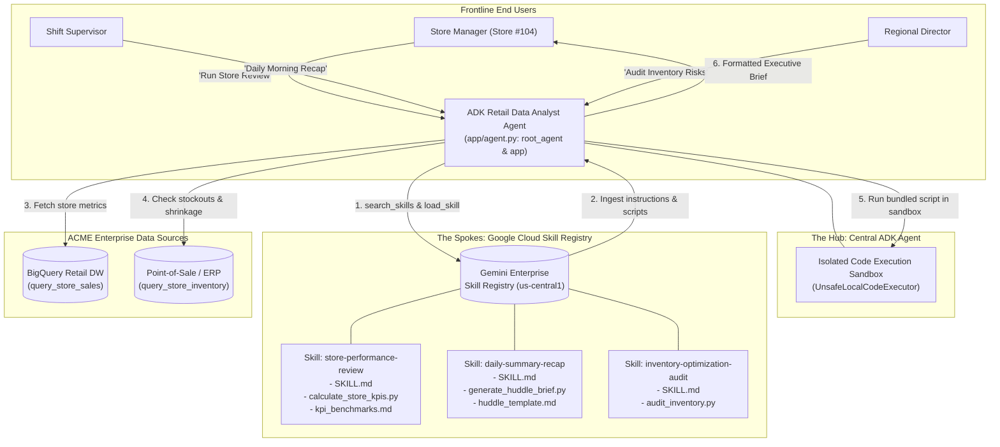

# ACME Inc: Gemini Enterprise Skill Registry & ADK Agent Architecture

A production-grade reference demo showcasing how enterprise teams can consume the new **Gemini Enterprise Agent Platform Skill Registry** within a custom **Agent Development Kit (ADK 2.x)** agent.

Built for **ACME Inc** to address their core architectural objective: empowering frontline non-power users (such as Store Managers and Shift Supervisors) with specialized, role-specific procedural analysis using **one central, heavy-lifting Retail Data Analyst Agent** rather than building, maintaining, and paying for dozens of disconnected custom agents.

---

## 🏛️ 1. Architecture: The Hub-and-Spoke Pattern



### Why This Unlocks Immediate Value for ACME Inc:
- **Zero Agent Proliferation**: ACME Inc only needs to deploy and govern **1 primary ADK agent service**.
- **Dynamic Context Loading**: Rather than stuffing every standard operating procedure (SOP) into a bloated system prompt, skills are dynamically discovered and loaded into context **on demand**.
- **Decoupled Business Logic**: Data analysts and merchandisers can write, update, and publish new skills to the cloud registry without changing a single line of agent backend code or redeploying Cloud Run / Vertex AI Reasoning Engine containers.
- **Hermetic Code Execution**: Complex calculations (such as labor efficiency, budget variance, and conversion pacing) are delegated to deterministic Python scripts bundled directly in the skill package and executed in an isolated sandbox.

---

## 📂 2. Repository Layout

```text
demos/acme-skills-registry-adk/
├── README.md                      # Architecture and onboarding guide (this file)
├── DEMO_GUIDE.md                 # Demo walkthrough script for customer meetings
├── requirements.txt              # Production runtime dependencies
├── pyproject.toml                # UV package definition
├── .env.example                  # Environment template
│
├── app/
│   ├── __init__.py               # Package marker
│   ├── agent.py                  # Primary ADK agent exporting `app` and `root_agent`
│   ├── tools.py                  # Retail data tools (query_store_sales, query_store_inventory)
│   └── registry.py               # Enterprise Skill Registry connector & local fallback
│
├── skills/                       # Standard agentskills.io format packages
│   ├── store-performance-review/
│   │   ├── SKILL.md              # Full financial and labor diagnostic instructions
│   │   ├── references/           # KPI thresholds and margin targets
│   │   │   └── kpi_benchmarks.md
│   │   └── scripts/              # Deterministic Python calculation script
│   │       └── calculate_store_kpis.py
│   ├── daily-summary-recap/
│   │   ├── SKILL.md              # 3-minute morning huddle recap for floor managers
│   │   ├── references/
│   │   │   └── huddle_template.md
│   │   └── scripts/
│   │       └── generate_huddle_brief.py
│   └── inventory-optimization-audit/
│       ├── SKILL.md              # Stockout risk and replenishment audit instructions
│       └── scripts/
│           └── audit_inventory.py
│
├── scripts/
│   ├── publish_skills_to_gcp.py  # Automation tool to package and upload skills to GCP
│   └── test_agent_skills.py      # Automated E2E verification test suite (100% pass)
│
└── dashboard/                    # Interactive executive presentation tier
    ├── server.py                 # FastAPI backend with live execution tracing
    └── static/                   # Google Cloud themed responsive web console
        ├── index.html
        ├── app.css
        └── app.js
```

---

## ⚙️ 3. How ADK Consumes Skills

ADK 2.x natively provides the `SkillToolset` and `GCPSkillRegistry` integrations:

```python
from google.adk import Agent, App
from google.adk.code_executors import UnsafeLocalCodeExecutor
from google.adk.tools.skill_toolset import SkillToolset
from app.registry import get_skill_registry
from app.tools import query_store_sales, query_store_inventory

# 1. Connect to the Enterprise Skill Registry
registry = get_skill_registry(project_id="acme-retail-prod", location="us-central1")

# 2. Bind the SkillToolset with an isolated code executor
skill_toolset = SkillToolset(
    registry=registry,
    code_executor=UnsafeLocalCodeExecutor()
)

# 3. Equip the central agent
root_agent = Agent(
    name="retail_data_analyst",
    model="gemini-2.5-flash",
    instruction="You are ACME Inc's Retail Data Analyst. Dynamically discover and load skills.",
    tools=[query_store_sales, query_store_inventory, skill_toolset]
)

# 4. Export the top-level app object required by ADK
app = App(root_agent=root_agent, name="app")
```

### Runtime Tool Injections:
When `SkillToolset` is added to the agent, ADK automatically provisions 5 specialized tools:
1. `search_skills(query)`: Queries the cloud registry for matching skill frontmatter.
2. `list_skills()`: Returns all available registered skills.
3. `load_skill(skill_name)`: Ingests the `SKILL.md` markdown instructions into active context.
4. `load_skill_resource(skill_name, file_path)`: Reads secondary files (e.g. `references/kpi_benchmarks.md`).
5. `run_skill_script(skill_name, file_path, args)`: Executes bundled scripts inside the sandbox.

---

## 🚀 4. Quickstart & Verification

### Step 1: Clone & Configure Environment
```bash
cd demos/acme-skills-registry-adk
cp .env.example .env

# Authenticate with Google Cloud Application Default Credentials
gcloud auth application-default login
```

### Step 2: Run Verification Test Suite
Run the 7-stage automated verification suite testing retail data queries, registry discovery, script execution, and ADK agent tool resolution:
```bash
python scripts/test_agent_skills.py
```
*Expected Output:*
```text
======================================================================
🧪 Running ACME Retail Skills & ADK Agent E2E Verification Suite
======================================================================
test_agent_attributes (__main__.TestADKAgentConfiguration) ... ok
test_skill_toolset_tools (__main__.TestADKAgentConfiguration) ... ok
test_query_store_inventory (__main__.TestRetailDataTools) ... ok
test_query_store_sales_downtown (__main__.TestRetailDataTools) ... ok
test_query_store_sales_yesterday (__main__.TestRetailDataTools) ... ok
test_get_skill_content (__main__.TestSkillRegistryAndLoading) ... ok
test_list_and_search_skills (__main__.TestSkillRegistryAndLoading) ... ok
test_calculate_store_kpis_script (__main__.TestSkillScriptExecution) ... ok
test_generate_huddle_brief_script (__main__.TestSkillScriptExecution) ... ok

----------------------------------------------------------------------
Ran 9 tests in 0.092s
OK
✅ All 7 verification test cases passed successfully!
```

### Step 3: Package & Publish Skills to Google Cloud
To inspect the package creation and upload simulation:
```bash
# Dry run verification
python scripts/publish_skills_to_gcp.py --dry-run

# Live upload to your GCP project
python scripts/publish_skills_to_gcp.py --project your-gcp-project-id --location us-central1
```

### Step 4: Launch the Interactive Visual Showcase
```bash
python dashboard/server.py
```
Open **`http://localhost:8080`** in your browser to explore:
- The **Skill Registry Explorer** inspecting raw `SKILL.md` specifications and scripts.
- The **Interactive Agent Console** testing store manager queries across Stores #104, #208, and #315.
- The **Live Telemetry Trace** observing in-flight skill discovery, loading, data retrieval, and script calculation in real time.

---

## 📋 5. ACME Inc Onboarding Guide (Beta Access)

### 1. Project Prerequisites & Enabling Cloud APIs
Ensure your Google Cloud project has the following APIs enabled:
```bash
gcloud services enable \
    aiplatform.googleapis.com \
    agentregistry.googleapis.com
```

### 2. IAM Roles Configuration
Assign the required permissions to your development identity and the agent service account:
```bash
# Allow agent runtime to discover and download skills
gcloud projects add-iam-policy-binding YOUR_PROJECT_ID \
    --member="serviceAccount:YOUR_AGENT_SA@YOUR_PROJECT_ID.iam.gserviceaccount.com" \
    --role="roles/aiplatform.user"

# Allow administrators to publish and manage skills in the registry
gcloud projects add-iam-policy-binding YOUR_PROJECT_ID \
    --member="user:lead-architect@acme.com" \
    --role="roles/agentregistry.admin"
```

### 3. Regional Endpoints
The Gemini Enterprise Agent Platform Skill Registry is active in the `us-central1` region:
- REST API Endpoint: `https://us-central1-aiplatform.googleapis.com/v1beta1/projects/{PROJECT_ID}/locations/us-central1/skills`
