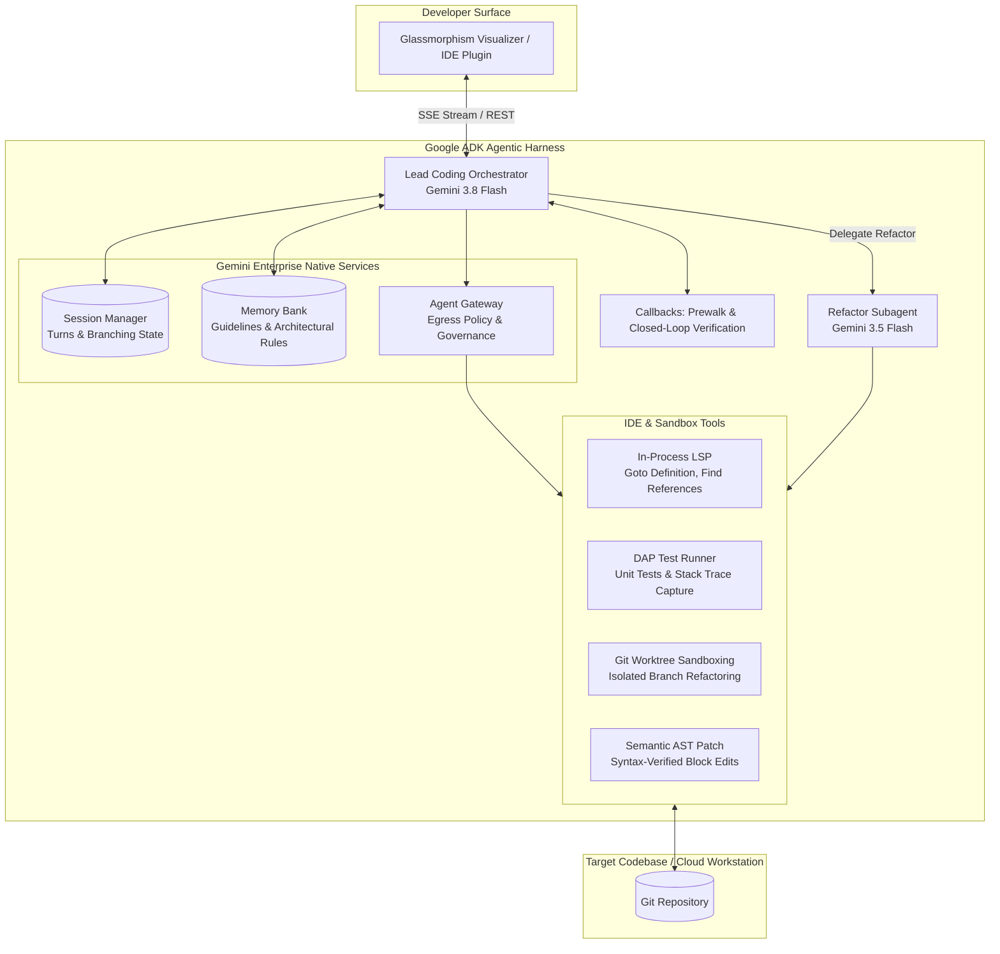

# Gemini Enterprise Coding Harness

> **"Agent = Model + Harness"**  
> An enterprise-grade AI coding agent demonstration built with the **Google Agent Development Kit (ADK)**, **Vertex AI Memory Bank**, **Session Manager**, and **Git Worktree Isolation**, implementing the core architectural paradigms of the *Harness Playbook*.

---

## 🏛️ Executive Summary & Value Proposition

Across the industry in 2026, raw model intelligence is rapidly commoditizing. Frontier reasoning models (Claude 3.7 Sonnet, Gemini 3.5/3.8 Flash, OpenAI o3) perform with comparable synthetic benchmark scores. 

However, **over 80% of enterprise coding agent initiatives fail to reach production**. The root cause is not model intelligence—it is the lack of a deterministic, enterprise-grade **Harness**.

This demo showcases how **Google Cloud Gemini Enterprise & ADK** provide the exact architectural pillars required for a resilient coding agent:
1. **Prewalk Grounding Ritual**: Querying **Vertex AI Memory Bank** and workspace Git state prior to execution, preventing blind hallucinations.
2. **In-Process Language Server Protocol (LSP)**: Navigating AST symbol definitions, references, and diagnostics without blowing token budgets on brute-force file dumps.
3. **Subagent Worktree Isolation**: Spawning specialized subagents in ephemeral Git worktrees to safeguard production branches.
4. **Closed-Loop AST Verification**: Catching syntax and typing errors immediately via `after_tool_run` callbacks, eliminating the self-referential repair loops seen in open-source hash-anchored diffs.
5. **Transcript Trees & Rewind**: Managing session state and branch rollbacks through the **Session Manager** (analogous to virtual DOM reconciliation).
6. **Cross-Session Memory Consolidation**: Synthesizing newly discovered rules back into **Memory Bank** so the harness compounds knowledge over time.

---

## 📐 Architecture



---

## 🚀 Quickstart & Running the Demo

### 1. Requirements
- Python 3.10+
- Dependencies: `fastapi`, `uvicorn`, `pydantic`, `google-cloud-aiplatform`, `google-genai`, `pytest`

Install dependencies:
```bash
pip install -r requirements.txt
```

### 2. Launching the Demo Server

#### Option A: Local Offline Mode (Default)
Starts 100% hermetically in-memory with zero GCP credential requirements and zero network egress:
```bash
./run_demo.sh
```

#### Option B: Live Managed Services (Vertex AI Memory Bank + ADK Sessions)
Enables persistent cloud backends using `VertexAiSessionService` and `MemoryBankServiceClient`:
```bash
./run_demo.sh --use-managed-services
```
Or via environment variables:
```bash
export USE_MANAGED_SERVICES=true
export GCP_PROJECT="your-project-id"
export GOOGLE_CLOUD_LOCATION="us-central1"
export GOOGLE_CLOUD_AGENT_ENGINE_ID="your-agent-engine-id"
./run_demo.sh
```

#### Granular Service Toggles
You can enable managed persistence for one service while keeping the other local:
```bash
# Managed Sessions with Local Memory Bank
./run_demo.sh --use-managed-sessions

# Managed Memory Bank with Local Sessions
./run_demo.sh --use-managed-memory-bank
```

### 3. Running the Automated Test Suite
Run the full test suite covering offline execution and mocked managed adapters:
```bash
pytest tests/ -v
```

### 4. Access the Web Visualizer
Open in your browser:
```text
http://tonyruiz.c.googlers.com:8080
```
Notice the **Backend Mode** badges in the navigation bar and inspector tabs indicating active service status (`LOCAL` vs `MANAGED`).

---

## 🎬 5-Minute Customer Walkthrough Script

### Act 1: The Pitch (1 min)
- **Say**: *"Customers often ask: 'If all models are smart, why are our coding agents still breaking our build?' The answer is the Harness. In this demo, we'll see Gemini Enterprise provide the deterministic harness around the model."*

### Act 2: Prewalk Grounding & Memory Bank (1 min)
- Click the chip: `Refactor SessionManager to support non-blocking async SQLite storage`.
- Point out the **Prewalk Grounding** box in the stream:
  - *"Notice how the agent didn't guess. The `before_agent_run` callback queried our Vertex AI Memory Bank and pulled our enterprise rule: 'All DB calls must use non-blocking async clients.' It also grounded on branch `main`."*

### Act 3: Semantic AST Navigation via LSP (1 min)
- Highlight the `lsp_find_definition` tool call:
  - *"Instead of dumping a 1,000-line file into the prompt window and burning $0.50 in tokens, the agent invoked in-process LSP to retrieve the exact AST symbol definition in under 30 tokens."*

### Act 4: Subagent Git Worktree Sandboxing (1 min)
- Click on the **Worktree & Diff** tab in the right panel:
  - *"The lead agent spawned a specialized Refactor Subagent in an isolated Git worktree (`feat-async-refactor`). If the subagent writes broken code, our main working branch is completely untouched."*

### Act 5: Closed-Loop Verification & Memory Consolidation (1 min)
- Show the `apply_semantic_patch` and `dap_run_pytest` outputs:
  - *"The patch is applied with immediate AST validation. Tests run inside the DAP sandbox and pass (4/4)."*
- Switch to the **Memory Bank** tab:
  - *"Notice that the agent extracted a new learning from this session: 'Maintain backward compatibility for synchronous rewind snapshots.' The next time a developer works on this repo, the agent will already know this rule."*
- Switch to the **Session Tree** tab and click **Rewind**:
  - *"Show that every turn state is snapshotted, allowing developers to roll back state instantly."*
