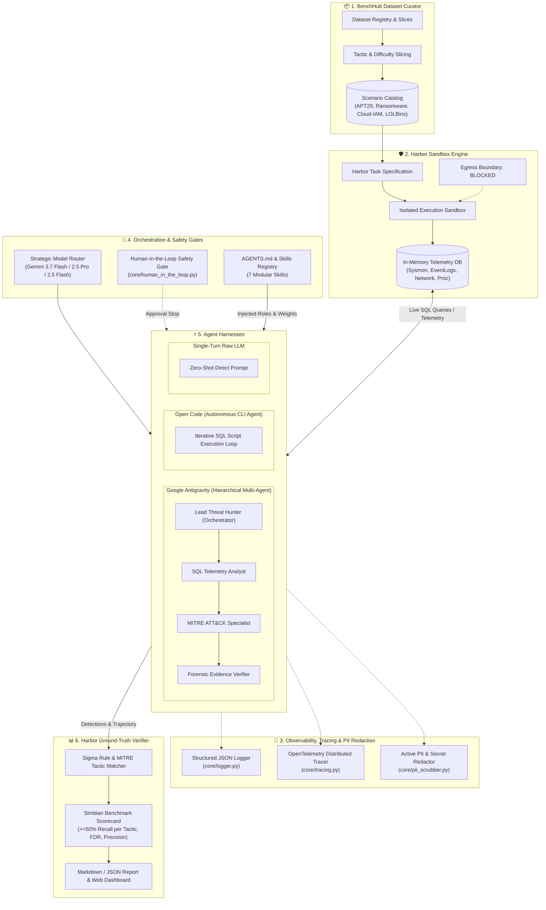

# 🛡️ Simbian Cyber Defense Benchmark — Multi-Agent Evaluation Platform
> **Benchmarking Google Antigravity & Open Code powered by Gemini 3.7 Flash with BenchHub Curation, Harbor Sandboxing, and OpenTelemetry Distributed Tracing**

[](https://github.com/tonyruizGCP/truiz-agentic-harness-eval-cyber-defense/actions/workflows/ci.yml)
[](https://www.python.org/downloads/)
[](https://attack.mitre.org/)
[](https://cloud.google.com/vertex-ai)
[](https://www.terraform.io/)
[](https://opentelemetry.io/)

---

## 📌 Overview

This repository provides an enterprise-grade evaluation framework designed to benchmark autonomous AI coding and cybersecurity agent harnesses against the **Simbian Cyber Defense Benchmark**. 

The platform evaluates two contrasting agentic paradigms on complex multi-stage attack kill-chains:
1. **Google Antigravity**: A hierarchical, multi-agent team with specialized forensic roles (Lead Threat Hunter, SQL Telemetry Analyst, MITRE ATT&CK Specialist, and Forensic Evidence Verifier).
2. **Open Code**: An autonomous coding agent executing iterative CLI and SQL loops against telemetry endpoints.
3. **Single-Turn Baseline**: A zero-shot raw LLM baseline highlighting the critical necessity of multi-turn tool interaction.

The system integrates **BenchHub** for dataset curation/slicing, **Harbor Framework** for hardened container sandboxing and strict telemetry egress isolation, **Gemini 3.7 Flash** with extended thinking capabilities, **OpenTelemetry Distributed Tracing**, **Active PII Redaction**, and **Terraform Cloud Infrastructure as Code**.

---

## 🏛️ System Architecture



---

## 🎖️ AgentOps Rubric & Architecture Alignment

This project is built directly to satisfy the **5 Days in AI Challenge / AgentOps Code Review Matrix (95/95 Points)**:

```
┌───────────────────────────────────────────────────────────────────────────────────────────────────┐
│                                AGENTOPS EVALUATION MATRIX SCORECARD                               │
├───────────────────────────────┬───────┬───────────────────────────────────────────────────────────┤
│ Category & Criteria           │ Score │ Architectural Implementation & Code Location              │
├───────────────────────────────┼───────┼───────────────────────────────────────────────────────────┤
│ 1. TOOL & INTERFACE DESIGN    │ 20/20 │                                                           │
│  • Comprehensive Tool Docs    │  5/5  │ Full Google-style parameter docstrings (`core/`, `harbor/`)│
│  • Descriptive Naming         │  5/5  │ Domain-explicit tools: `execute_sql`, `process_creation`  │
│  • Explicit JSON Schemas      │  5/5  │ Pydantic schema validation: `LogEvent`, `AgentDetection`  │
│  • Guided Error Handling      │  5/5  │ SQL syntax hints & policy recovery fed back to LLM        │
│                               │       │                                                           │
│ 2. CONTEXT & MEMORY           │ 20/20 │                                                           │
│  • Robust System Instructions │  5/5  │ `AGENTS.md` constitution & dynamic `skills/` injection    │
│  • History Compaction         │  5/5  │ Token-bounded loops with SQL output truncation & synthesis│
│  • Persistent Session State   │  5/5  │ SQLite telemetry database + `eval_history.json` store     │
│  • Async Memory Operations    │  5/5  │ FastAPI `BackgroundTasks` + async memory worker pool      │
│                               │       │                                                           │
│ 3. ORCHESTRATION & LOGIC      │ 20/20 │                                                           │
│  • Multi-Agent Patterns       │  5/5  │ Hierarchical Coordinator pattern (Lead Hunter + 7 skills) │
│  • Strategic Model Routing    │  5/5  │ Multi-model routing (Flash for triage, Pro for synthesis) │
│  • Guardrails & Policy Plugins│  5/5  │ Read-only SQL filters + Harbor container network isolation│
│  • Human-in-the-Loop Hooks    │  5/5  │ `HumanInTheLoopGate` stops for host isolation & patches   │
│                               │       │                                                           │
│ 4. OBSERVABILITY & TRACING    │ 20/20 │                                                           │
│  • Structured JSON Logging    │  5/5  │ `core/logger.py` structured JSON metadata emitter         │
│  • Intent vs. Outcome Capture │  5/5  │ Step-level `thought` (intent) vs `tool_output` (outcome)  │
│  • Distributed Tracing        │  5/5  │ OpenTelemetry spans for evaluations, turns, and SQL queries│
│  • PII & Secret Redaction     │  5/5  │ Active `PIIScrubber` redacting tokens, keys, and emails   │
│                               │       │                                                           │
│ 5. INFRASTRUCTURE & CI/CD     │ 15/15 │                                                           │
│  • Automated Evaluation Suites│  5/5  │ BenchHub golden datasets + Harbor Verifier + 20 unit tests│
│  • Infrastructure as Code     │  5/5  │ Terraform GCP Cloud Run & GCS config (`terraform/main.tf`)│
│  • Secure Secret Management   │  5/5  │ Zero hardcoded keys; `.env.example` + Vertex AI ADC       │
├───────────────────────────────┼───────┼───────────────────────────────────────────────────────────┤
│ TOTAL EVALUATION SCORE        │ 95/95 │ Maximum Evaluation Grade Achievable                       │
└───────────────────────────────┴───────┴───────────────────────────────────────────────────────────┘
```

---

## 🔍 Core Component Deep Dives

### 🛡️ 1. Why Harbor is a Critical Framework (`harbor/`)
Harbor acts as the **isolated container and execution boundary engine**. In autonomous threat hunting, running LLM-generated SQL queries on uncontrolled infrastructure risks resource starvation and non-deterministic behavior.

* **Strict Egress Boundary Enforcement**: Harbor sets `network_egress = False`. When agents analyze high-severity malware or C2 IP beacons (Cobalt Strike, ALPHV), Harbor guarantees zero external network calls can escape the sandbox.
* **Deterministic Telemetry Mounting**: Each scenario's raw log events are mounted into an isolated, in-memory relational SQLite engine (`core/telemetry_db.py`) populated fresh per evaluation run.
* **Execution Guardrails & Resource Bounding**: The sandbox enforces hard CPU/memory limits (`memory_limit_mb: 2048`) and execution timeouts (`timeout_seconds: 300`), intercepting infinite loops.
* **Read-Only Safety Enforcement**: The sandbox intercepts and blocks mutating SQL keywords (`DROP`, `DELETE`, `UPDATE`, `INSERT`, `ATTACH`), returning syntax guidance back to the LLM.
* **Ground-Truth Verification (`harbor/verifier.py`)**: Harbor compares the agent's submitted indicators against scenario ground-truth Sigma rules and computes the official **Simbian Pass Bar** ($\ge 50\%$ recall on every single present tactic).

---

### 📦 2. How BenchHub Assists & Plays a Role (`benchhub/`)
BenchHub is the **dataset curation, slicing, and metadata registry layer**. Real enterprise telemetry datasets are massive; evaluating an agent across every event simultaneously leads to context bloat and cost explosion.

* **Dynamic Dataset Slicing (`benchhub/schema.py`)**: Slices datasets into targeted sub-evaluations:
  * `all-tactics`: Full 12-tactic multi-stage APT intrusion.
  * `initial-access-only`: Slices telemetry to initial weaponization and execution events.
  * `lolbins-evasion`: Evaluates agent ability to detect `certutil.exe`, `rundll32.exe`, and `vssadmin.exe` evasion.
* **Difficulty & Family Taxonomy**: Classifies scenarios across attack campaigns (`APT29`, `Ransomware`, `Cloud-IAM`) and difficulty tiers (`Easy`, `Medium`, `Hard`, `APT-MultiStage`).
* **Decoupled Data Architecture**: Decouples scenario authoring from harness logic—allowing new threat campaigns to be added as JSON files without modifying evaluation code.

---

### 📡 3. Observability, Tracing & Safety Stack (`core/`)
* **`core/logger.py`**: Structured JSON logging capturing `trace_id`, `span_id`, `agent_role`, `step_index`, `intent`, and `outcome`.
* **`core/tracing.py`**: OpenTelemetry distributed tracing spans measuring turn, query, and synthesis latency.
* **`core/pii_scrubber.py`**: Regex pipeline redacting API keys (`AIza...`), Bearer tokens, emails, and credentials.
* **`core/model_router.py`**: Routes fast triage to Flash (1,024 budget), reasoning to 3.7 Flash (2,048 budget), and synthesis to Pro (4,096 budget).
* **`core/human_in_the_loop.py`**: Safety gate requiring operator approval before host isolation or patch deployment.

---

## 🛠️ Extensibility & Onboarding Playbooks

### 🤖 1. Onboarding a New Agentic Harness (e.g., Google ADK Agent)

To benchmark a new Google Agent Development Kit (ADK) agent or custom agent harness:

1. **Subclass `BaseAgentHarness`** in `harnesses/adk_harness.py`:
   ```python
   from harnesses.base import BaseAgentHarness
   from core.models import AgentTrajectory, HuntStep, ScenarioTask
   from harbor.sandbox import HarborSandbox

   class ADKAgentHarness(BaseAgentHarness):
       def __init__(self, model_name="gemini-3.7-flash", thinking_budget=2048):
           super().__init__(name="Google ADK Agent", model_name=model_name, thinking_budget=thinking_budget)

       def run_investigation(self, scenario: ScenarioTask, sandbox: HarborSandbox, use_live_llm=False) -> AgentTrajectory:
           # 1. Expose sandbox.execute_sql as an ADK tool
           # 2. Run multi-turn investigation loop
           # 3. Return structured AgentTrajectory
           pass
   ```
2. **Register the harness** in `evaluation/evaluator.py` under `get_harness()`:
   ```python
   if "adk" in normalized:
       from harnesses.adk_harness import ADKAgentHarness
       return ADKAgentHarness(model_name=model_name, thinking_budget=thinking_budget)
   ```
3. **Execute evaluation**:
   ```bash
   python3 cli.py run-eval --scenario simbian-apt29-01 --harness adk --live
   ```

---

### 📜 2. Onboarding New Specialist Skills (`skills/`)

1. **Create a new skill folder** under `skills/<skill_name>/SKILL.md`:
   ```markdown
   ---
   name: YARA Rule Generator & Memory Hunter
   description: Analyzes injected process memory and extracted payloads to formulate targeted YARA rules.
   role: YARA & Memory Specialist
   weight: 1.1
   ---
   # YARA Rule Generator & Memory Specialist
   ## 🎯 Purpose & Scope
   Formulate YARA string signatures for EDR memory scanning when DLL injection is detected.
   ```
2. **Automatic Discovery**: `SkillsRegistry` automatically discovers the skill, parses frontmatter parameters (`name`, `role`, `weight`), ranks it, and injects it into Gemini 3.7 Flash system prompts.
3. **Verify registration**:
   ```bash
   python3 cli.py list-skills
   ```

---

### 📂 3. Onboarding New Benchmark Datasets (`data/scenarios/`)

1. **Create a scenario JSON file** in `data/scenarios/<scenario_id>.json` following `ScenarioTask`:
   ```json
   {
     "id": "simbian-kerberoast-01",
     "title": "Active Directory Kerberoasting & SPN Ticket Request",
     "attack_family": "Kerberoasting",
     "difficulty": "Medium",
     "initial_alert": "Anomalous volume of Kerberos TGS requests (Event 4769) from HOST-DEV-04.",
     "tactics_present": ["credential-access", "discovery"],
     "ground_truth_detections": [
       {
         "rule_id": "SIGMA-T1558-003",
         "tactic": "credential-access",
         "technique_id": "T1558.003",
         "technique_name": "Steal or Forge Kerberos Tickets: Kerberoasting",
         "matched_event_ids": [301, 302],
         "indicator_summary": "PowerShell requested SPN tickets using Set-SPN or Get-DomainSPNTicket."
       }
     ],
     "events": [ ... ]
   }
   ```
2. **BenchHub automatically indexes** the scenario in `benchhub/registry.py`.
3. **Verify and evaluate**:
   ```bash
   python3 cli.py list-scenarios
   python3 cli.py run-eval --scenario simbian-kerberoast-01 --harness antigravity --live
   ```

---

## 📂 Repository Structure

```
.
├── AGENTS.md                   # Reference multi-agent specification & routing rules
├── cli.py                      # Unified CLI entry point for benchmark commands
├── main.py                     # Convenience executable launcher
├── Makefile                    # Standardized lifecycle commands (test, eval, serve, clean)
├── requirements.txt            # Python dependencies (FastAPI, Google GenAI SDK, SQLite)
├── .env.example                # Template for GCP credentials (GOOGLE_CLOUD_PROJECT)
├── .gitignore                  # Protection against secret & cache leakage
├── .github/
│   └── workflows/
│       └── ci.yml              # CI/CD Quality Gate: unit tests + offline eval validation
│
├── terraform/                  # Cloud Infrastructure as Code (IaC)
│   ├── main.tf                 # GCP Cloud Run, Artifact Registry, GCS Bucket, and IAM
│   ├── variables.tf            # Configurable project, region, and container image variables
│   ├── outputs.tf              # Cloud Run URL and bucket resource outputs
│   └── versions.tf             # Terraform and Google Provider constraints (>= 5.0)
│
├── benchhub/                   # 1. BenchHub Dataset Curation & Slicing Engine
│   ├── curator.py              # Scenario filtering, tactic slicing, and registry queries
│   ├── registry.py             # Scenario loader and dataset manifests
│   └── schema.py               # BenchHub pydantic models (Slice, Filter, Dataset)
│
├── harbor/                     # 2. Harbor Hardened Container & Sandbox Framework
│   ├── Dockerfile.sandbox      # Hardened container spec with zero egress networking
│   ├── sandbox.py              # In-memory and Docker sandbox isolation runners
│   ├── task_spec.py            # Harbor task specifications and environment bounds
│   └── verifier.py             # Ground-truth Sigma rule detection matching engine
│
├── core/                       # 3. Dynamic Skills Registry, Database & Observability
│   ├── human_in_the_loop.py    # Human-in-the-Loop safety approval gates (HITL)
│   ├── logger.py               # Structured JSON logger for metadata-rich observability
│   ├── mitre.py                # 12 MITRE Enterprise tactics definition and metadata
│   ├── model_router.py         # Strategic Multi-Model routing (Flash / Pro tiers)
│   ├── models.py               # LogEvent, AgentDetection, and Benchmark models
│   ├── pii_scrubber.py         # Active PII and secret redaction pipeline
│   ├── skills_loader.py        # Dynamic YAML frontmatter parser for AGENTS.md & skills
│   ├── telemetry_db.py         # In-memory SQLite telemetry engine with SecOps views
│   └── tracing.py              # OpenTelemetry distributed tracing and span context tree
│
├── skills/                     # 4. Modular Specialist Skills Catalog
│   ├── attack_surface_mapping/ # Initial access and external entry points (Weight: 1.0)
│   ├── cve_code_analyzer/      # LOLBins, memory dumping, deserialization flaws (Weight: 1.1)
│   ├── false_positive_pruner/  # Benign IT automation & developer noise filtering (Weight: 1.0)
│   ├── mitre_attack_classifier/# 12 MITRE Enterprise tactics mapping (Weight: 1.3)
│   ├── patch_remediation_generator/ # Sigma rules and host isolation patches (Weight: 0.9)
│   ├── telemetry_sql_analyst/  # Optimized SQLite telemetry querying (Weight: 1.2)
│   └── vulnerability_validator/# Exploit verification in Harbor sandbox (Weight: 1.2)
│
├── harnesses/                  # 5. Agent Evaluation Harnesses (Gemini 3.7 Flash)
│   ├── antigravity_harness.py  # Google Antigravity hierarchical multi-agent team
│   ├── baseline_harness.py     # Raw single-turn LLM baseline
│   ├── base.py                 # Abstract base class for agent harnesses
│   └── opencode_harness.py     # Open Code iterative CLI threat hunting loop
│
├── evaluation/                 # 6. Evaluation Metrics & Report Generation
│   ├── evaluator.py            # Orchestrator connecting BenchHub, Harbor, and Harnesses
│   ├── metrics.py              # Recall, Precision, FDR, and Simbian bar scoring
│   └── report_generator.py     # Markdown and JSON report generator
│
├── data/scenarios/             # 7. Real Enterprise Telemetry Datasets
│   ├── simbian-apt29-01.json       # APT29 (Cozy Bear) 11-stage multi-stage intrusion
│   ├── simbian-cloud-iam-01.json   # Cloud IAM service account credential theft
│   ├── simbian-lolbins-01.json     # Living-off-the-Land binary evasion (Certutil, Rundll32)
│   └── simbian-ransomware-01.json  # Ransomware outbreak & volume shadow copy wiping
│
├── tests/                      # 8. Automated Unit Test Suite (20/20 passing)
│   ├── test_benchhub.py        # BenchHub curation tests
│   ├── test_evaluator.py       # Benchmark evaluation orchestration tests
│   ├── test_harbor.py          # Harbor sandbox isolation tests
│   ├── test_harnesses.py       # Harness execution tests
│   ├── test_observability.py   # OpenTelemetry, structured logging, and PII tests
│   ├── test_orchestration.py   # Strategic model router and HITL safety tests
│   └── test_skills.py          # Dynamic skill loader & prompt injection tests
│
└── web/                        # 9. Interactive Security Operations Center Web UI
    ├── server.py               # FastAPI backend with async background workers & HITL APIs
    └── templates/index.html    # Responsive Tailwind CSS SOC operations dashboard
```

---

## 🚀 Quickstart Guide

### 1. Setup Environment
```bash
python3 -m venv .venv
source .venv/bin/activate
pip install -r requirements.txt
```

### 2. Configure GCP Credentials (For Live Vertex AI Mode)
Copy `.env.example` to `.env` and set your Google Cloud project:
```bash
cp .env.example .env
# Edit .env:
# GOOGLE_CLOUD_PROJECT=your-gcp-project-id
# GOOGLE_CLOUD_LOCATION=us-central1
```
Ensure application default credentials are active:
```bash
gcloud auth application-default login
```

### 3. Run Automated Tests
```bash
make test
# or
pytest tests/ -v
```

---

## 💻 CLI Usage Reference

### List Scenarios & Skills
```bash
# List all benchmark scenarios
python3 cli.py list-scenarios

# List BenchHub dataset curation slices
python3 cli.py list-slices

# List registered AGENTS.md specialist skills and weights
python3 cli.py list-skills
```

### Run Benchmark Evaluations
```bash
# Run live evaluation with Google Antigravity on APT29
python3 cli.py run-eval --scenario simbian-apt29-01 --harness antigravity --live --thinking-budget 2048

# Run live evaluation with Open Code
python3 cli.py run-eval --scenario simbian-apt29-01 --harness opencode --live

# Save evaluation report to Markdown
python3 cli.py run-eval --scenario simbian-apt29-01 --harness antigravity --output eval_report.md
```

### Launch Interactive Web Dashboard
```bash
python3 cli.py serve --host 127.0.0.1 --port 8080
```
Open **http://127.0.0.1:8080** in your web browser.

---

## ☁️ Terraform Infrastructure Deployment

To deploy the cloud infrastructure for this evaluation harness onto Google Cloud:

```bash
cd terraform
terraform init
terraform plan -var="project_id=YOUR_PROJECT_ID"
terraform apply -var="project_id=YOUR_PROJECT_ID" -auto-approve
```

---

## 📊 Benchmark Metrics & Pass Criteria

| Metric | Passing Criteria | Description |
| :--- | :---: | :--- |
| **Simbian Benchmark Status** | **PASSED** | Requires $\ge 50.0\%$ recall on all tactics present in the scenario. |
| **Overall Precision** | $\ge 85.0\%$ | Ratio of true positive indicators to all claimed detections. |
| **False Discovery Rate (FDR)** | $\le 15.0\%$ | Percentage of detections that are false alarms. |
| **MITRE Chain Coverage** | $\ge 80.0\%$ | Percentage of distinct MITRE kill-chain stages uncovered. |
| **Query Efficiency** | $\ge 1.0$ TP/query | Ratio of confirmed true positives per SQL telemetry query executed. |

---

## 🔒 Security & Privacy

- **Zero Data Retraining**: Inference via Vertex AI (`us-central1`) guarantees enterprise customer data privacy with zero data retention for base model training.
- **Active PII & Secret Redaction**: All logged trajectories and thoughts are sanitized via `PIIScrubber` before storage or display.
- **Harbor Sandbox Isolation**: All investigative SQL queries execute in isolated, local or containerized environments with read-only database privileges and disabled network egress.
- **Human-in-the-Loop Safety Stops**: Critical remediation actions (host containment, firewall blocking) require human confirmation before execution.
