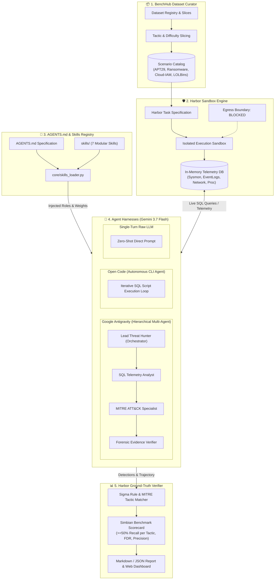

# 🛡️ Simbian Cyber Defense Benchmark — Multi-Agent Evaluation Platform
> **Benchmarking Google Antigravity & Open Code powered by Gemini 3.7 Flash with BenchHub Curation & Harbor Sandboxing**

---

## 📌 Overview

This repository provides an enterprise-grade evaluation framework designed to benchmark autonomous AI coding and cybersecurity agent harnesses against the **Simbian Cyber Defense Benchmark**. 

The platform evaluates two contrasting agentic paradigms on complex multi-stage attack kill-chains:
1. **Google Antigravity**: A hierarchical, multi-agent team with specialized forensic roles (Lead Threat Hunter, SQL Telemetry Analyst, MITRE ATT&CK Specialist, and Forensic Evidence Verifier).
2. **Open Code**: An autonomous coding agent executing iterative CLI and SQL loops against telemetry endpoints.
3. **Single-Turn Baseline**: A zero-shot raw LLM baseline highlighting the critical necessity of multi-turn tool interaction.

The system integrates **BenchHub** for dataset curation/slicing, **Harbor Framework** for hardened container sandboxing and strict telemetry egress isolation, and **Gemini 3.7 Flash** with extended thinking capabilities.

---

## 🏛️ System Architecture



---

## 📂 Repository Structure

```
.
├── AGENTS.md                   # Reference multi-agent specification & routing rules
├── cli.py                      # Unified CLI entry point for benchmark commands
├── main.py                     # Convenience executable launcher
├── requirements.txt            # Python dependencies (FastAPI, Google GenAI SDK, etc.)
├── .env.example                # Template for GCP credentials (GOOGLE_CLOUD_PROJECT)
├── benchhub/                   # BenchHub dataset curation & slicing engine
│   ├── curator.py              # Scenario filtering, tactic slicing, and registry queries
│   ├── registry.py             # Scenario loader and dataset manifests
│   └── schema.py               # BenchHub pydantic models (Slice, Filter, Dataset)
├── core/                       # Core telemetry and data representations
│   ├── mitre.py                # 12 MITRE Enterprise tactics definition and metadata
│   ├── models.py               # LogEvent, AgentDetection, and Benchmark models
│   ├── skills_loader.py        # Dynamic YAML frontmatter parser for AGENTS.md & skills
│   └── telemetry_db.py         # In-memory SQLite telemetry engine with SecOps views
├── data/                       # Telemetry datasets & intrusion scenarios
│   └── scenarios/
│       ├── simbian-apt29-01.json       # APT29 (Cozy Bear) 11-stage multi-stage intrusion
│       ├── simbian-cloud-iam-01.json   # Cloud IAM service account credential theft
│       ├── simbian-lolbins-01.json     # Living-off-the-Land binary evasion (Certutil, Rundll32)
│       └── simbian-ransomware-01.json  # Ransomware outbreak & volume shadow copy wiping
├── evaluation/                 # Simbian benchmark metrics & report generation
│   ├── evaluator.py            # Orchestrator connecting BenchHub, Harbor, and Harnesses
│   ├── metrics.py              # Recall, Precision, FDR, and Simbian bar scoring
│   └── report_generator.py     # Markdown and JSON report generator
├── harbor/                     # Harbor container and sandbox execution framework
│   ├── Dockerfile.sandbox      # Hardened container spec with zero egress networking
│   ├── sandbox.py              # In-memory and Docker sandbox isolation runners
│   ├── task_spec.py            # Harbor task specifications and environment bounds
│   └── verifier.py             # Ground-truth Sigma rule detection matching engine
├── harnesses/                  # Agent evaluation harnesses
│   ├── antigravity_harness.py  # Google Antigravity hierarchical multi-agent team
│   ├── baseline_harness.py     # Raw single-turn LLM baseline
│   ├── base.py                 # Abstract base class for agent harnesses
│   └── opencode_harness.py     # Open Code iterative CLI threat hunting loop
├── models/                     # LLM client abstractions
│   ├── gemini_client.py        # Vertex AI / Google GenAI SDK client for Gemini 3.7 Flash
│   └── mock_client.py          # High-fidelity offline simulation fallback
├── skills/                     # Modular agent skills catalog
│   ├── attack_surface_mapping/ # Initial access and external entry points (Weight: 1.0)
│   ├── cve_code_analyzer/      # LOLBins, memory dumping, deserialization flaws (Weight: 1.1)
│   ├── false_positive_pruner/  # Benign IT automation & developer noise filtering (Weight: 1.0)
│   ├── mitre_attack_classifier/# 12 MITRE Enterprise tactics mapping (Weight: 1.3)
│   ├── patch_remediation_generator/ # Sigma rules and host isolation patches (Weight: 0.9)
│   ├── telemetry_sql_analyst/  # Optimized SQLite telemetry querying (Weight: 1.2)
│   └── vulnerability_validator/# Exploit verification in Harbor sandbox (Weight: 1.2)
├── tests/                      # Automated test suite (13 passing unit tests)
│   ├── test_benchhub.py        # Tests for BenchHub dataset curation
│   ├── test_evaluator.py       # Tests for benchmark evaluation pipelines
│   ├── test_harbor.py          # Tests for Harbor sandbox execution
│   ├── test_harnesses.py       # Tests for agent harnesses
│   └── test_skills.py          # Tests for AGENTS.md and dynamic skills registry
└── web/                        # Interactive Security Operations Center Web UI
    ├── server.py               # FastAPI backend with REST endpoints
    └── templates/
        └── index.html          # Responsive Tailwind CSS SOC dashboard
```

---

## ⚙️ How It Works

### 1. Dataset Ingestion & Slicing (`benchhub/`)
BenchHub loads realistic multi-stage enterprise telemetry scenarios containing Windows Sysmon events (Event ID 1 process creation, Event ID 3 network sockets, Event ID 11 file modifications, Event ID 13 registry keys, and Event ID 4104 PowerShell ScriptBlocks). Slices allow evaluating agents against specific subsets (e.g. `initial-access-only`, `lolbins-evasion`, or `all-tactics`).

### 2. Sandboxed Environment Isolation (`harbor/`)
The scenario telemetry is loaded into an isolated in-memory relational SQLite engine (`core/telemetry_db.py`) inside the Harbor Sandbox. The agent cannot reach external networks and interacts strictly by executing read-only SQL queries against structured views (`process_creation`, `network_connections`, `persistence_events`, `powershell_scripts`).

### 3. Multi-Agent Skills Injection (`AGENTS.md` & `skills/`)
The `SkillsRegistry` dynamically scans `AGENTS.md` and the `skills/` directory, extracting role descriptions, execution procedures, and weights. These are formatted and injected directly into Gemini 3.7 Flash's system prompt to enforce specialized responsibilities and prevent query fixation.

### 4. Live Multi-Turn Investigation Loop (`harnesses/`)
- **Turn 1 (Alert Intake)**: The agent receives the alert context and generates targeted SQL queries.
- **Turn 2–4 (Telemetry Pivoting)**: The SQLite engine returns live row matches, and the agent investigates parent-child lineages, persistence keys, network C2 beacons, and memory access.
- **Synthesis Turn**: The orchestrator reviews all query outputs and extracts verified MITRE ATT&CK detections.

### 5. Harbor Ground-Truth Scoring (`evaluation/`)
The `HarborVerifier` matches the agent's detections against the scenario's ground truth Sigma rules and MITRE technique IDs. It computes:
- **Tactic Recall & Precision**: Detection rate per tactic vs. false alarms.
- **Strict Simbian Passing Bar**: Requires $\ge 50\%$ recall on **every single tactic present** in the attack kill-chain.
- **False Discovery Rate (FDR)**: $\frac{\text{FP}}{\text{TP} + \text{FP}}$.

---

## 🚀 Quickstart Guide

### 1. Setup Environment
```bash
python3 -m venv .venv
source .venv/bin/activate
pip install -r requirements.txt
```

### 2. Configure GCP Credentials (For Live Vertex AI Mode)
Copy `.env.example` to `.env` and set your Google Cloud project:
```bash
cp .env.example .env
# Edit .env:
# GOOGLE_CLOUD_PROJECT=your-gcp-project-id
# GOOGLE_CLOUD_LOCATION=us-central1
```
Ensure you have application credentials authenticated:
```bash
gcloud auth application-default login
```

### 3. Run Automated Tests
```bash
pytest tests/
```

---

## 💻 CLI Usage Reference

### List Scenarios & Skills
```bash
# List all benchmark scenarios
python3 cli.py list-scenarios

# List BenchHub dataset curation slices
python3 cli.py list-slices

# List registered AGENTS.md specialist skills and weights
python3 cli.py list-skills
```

### Run Benchmark Evaluations
```bash
# Run live evaluation with Google Antigravity on APT29
python3 cli.py run-eval --scenario simbian-apt29-01 --harness antigravity --live --thinking-budget 2048

# Run live evaluation with Open Code
python3 cli.py run-eval --scenario simbian-apt29-01 --harness opencode --live

# Save evaluation report to Markdown
python3 cli.py run-eval --scenario simbian-apt29-01 --harness antigravity --output eval_report.md
```

### Compare Harnesses Side-by-Side
```bash
python3 cli.py compare-harnesses --scenario simbian-apt29-01 --live
```

### Launch Interactive Web Dashboard
```bash
python3 cli.py serve --host 127.0.0.1 --port 8080
```
Open **http://127.0.0.1:8080** in your web browser.

---

## 📊 Benchmark Metrics & Pass Criteria

| Metric | Passing Criteria | Description |
| :--- | :---: | :--- |
| **Simbian Benchmark Status** | **PASSED** | Requires $\ge 50.0\%$ recall on all tactics present in the scenario. |
| **Overall Precision** | $\ge 85.0\%$ | Ratio of true positive indicators to all claimed detections. |
| **False Discovery Rate (FDR)** | $\le 15.0\%$ | Percentage of detections that are false alarms. |
| **MITRE Chain Coverage** | $\ge 80.0\%$ | Percentage of distinct MITRE kill-chain stages uncovered. |
| **Query Efficiency** | $\ge 1.0$ TP/query | Ratio of confirmed true positives per SQL telemetry query executed. |

---

## 🔒 Security & Privacy

- **Zero Data Retraining**: Inference via Vertex AI (`us-central1`) guarantees enterprise customer data privacy with zero data retention for base model training.
- **Harbor Sandbox Isolation**: All investigative SQL queries execute in isolated, local or containerized environments with read-only database privileges and disabled network egress.
- **No Mock Fallbacks in Live Mode**: Live runs (`--live`) execute genuine multi-turn LLM reasoning and real SQLite telemetry queries with full transparency.
