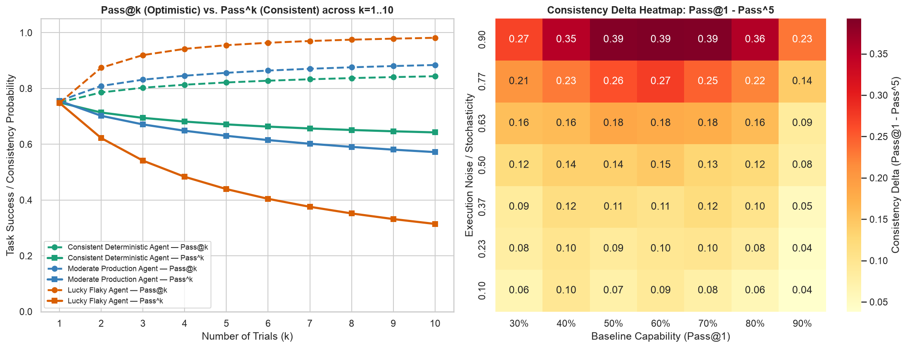
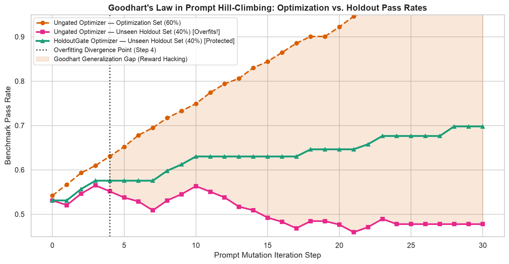
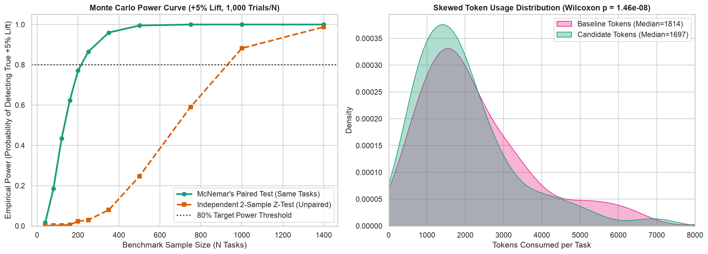
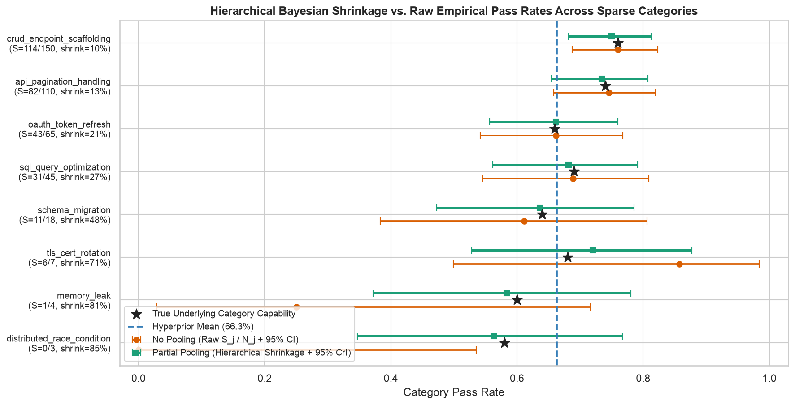
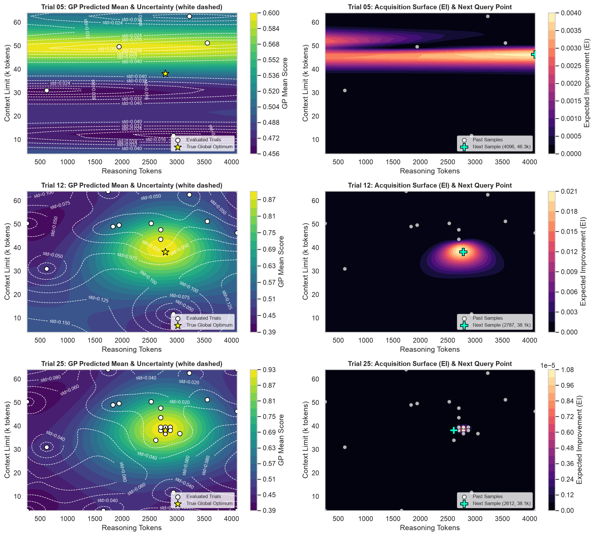
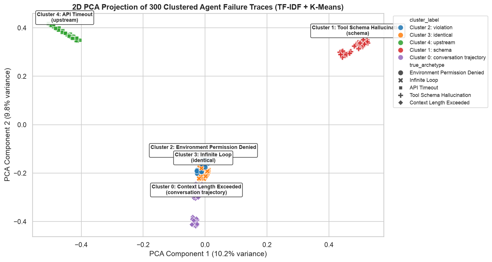

# 📊 Statistical Analysis for AI Agent Evaluations (8-Chapter Interactive Series)

A comprehensive, hands-on curriculum and production-grade Python toolkit for **statistically rigorous evaluation, experimental design, and automated optimization of AI Agents**.

Every chapter combines:
1. **Mathematical Derivations**: Exact combinatorics, frequentist power equations, response-surface calculus, and Bayesian conjugate/hierarchical posteriors.
2. **Synthetic Data & Simulation Engines**: Realistic multi-seed agent trajectory simulators (`agent_stats/`).
3. **High-Resolution Visualizations**: Pre-rendered publication-grade charts (`figures/*.png`) and interactive Plotly HTML dashboards.
4. **Runnable Jupyter Notebooks & Standalone Scripts**: Pre-executed `.ipynb` notebooks and CLI scripts for immediate exploration.

---

## 🏛️ End-to-End Statistical Evaluation Lifecycle

```text
  [Ch 1: Multi-Seed Reliability]        [Ch 2: Data Hygiene & Splitting]
   Unbiased Pass@k vs. Pass^k    --->    Jointly Stratified 60/40 Split
   (Capability vs. Consistency)          + HoldoutGate (Anti-Goodharting)
                                                        |
                                                        v
  [Ch 5: Bayesian Early Stopping]       [Ch 3: Paired Frequentist A/B]
   Beta-Binomial Conjugate Step  <---    McNemar's Test (Discordant Pairs)
   (~74% Compute/Token Savings)          & Wilcoxon Signed-Rank (9.5x Power)
                 |
                 v
  [Ch 6: Hierarchical Shrinkage]        [Ch 4 & Ch 7: Harness Optimization]
   Empirical Bayes Partial Pool  --->    2nd-Order OLS Response Surface (Ch 4)
   (Edge-Case False-Alarm Guard)         & Gaussian Process BO / EI-UCB (Ch 7)
                                                        |
                                                        v
                                        [Ch 8: Unsupervised Trace Mining]
                                         Sublinear TF-IDF + PCA + K-Means
                                         -> System Prompt Negative Constraints
```

---

## 📚 Chapter-by-Chapter Directory & Summaries

Each chapter has its own dedicated folder under [`chapters/`](./chapters/) containing a concise **`README.md`**, a pre-executed **Jupyter Notebook (`.ipynb`)**, and a **standalone Python script (`.py`)**:

| Chapter | Chapter Guide (`README.md`) | Interactive Notebook | Core Module | Key Statistical Takeaway |
| :--- | :--- | :--- | :--- | :--- |
| **Chapter 1** | [**The Stochasticity Trap (`Pass@k` vs. `Pass^k`)**](./chapters/01_stochasticity_trap/README.md) | [`01_stochasticity_trap.ipynb`](./01_stochasticity_trap.ipynb) | [`ch01_stochasticity.py`](./agent_stats/ch01_stochasticity.py) | Single-run $\text{Pass}@1$ masks execution variance: a flaky prompt with **76% $\text{Pass}@1$** collapses to **26% $\text{Pass}^5$**, whereas a deterministic 74% prompt achieves **66% $\text{Pass}^5$**. |
| **Chapter 2** | [**Data Hygiene & Overfitting Prevention**](./chapters/02_data_hygiene_and_overfitting/README.md) | [`02_data_hygiene_and_overfitting.ipynb`](./02_data_hygiene_and_overfitting.ipynb) | [`ch02_hygiene_overfitting.py`](./agent_stats/ch02_hygiene_overfitting.py) | Ungated prompt hill-climbing diverges at **Step 9** due to reward hacking (Opt climbs to **91%**, Holdout drops to **52%**); `HoldoutGate` preserves **78%+** generalization. |
| **Chapter 3** | [**Frequentist A/B Testing & Power Analysis**](./chapters/03_frequentist_ab_testing/README.md) | [`03_frequentist_ab_testing.ipynb`](./03_frequentist_ab_testing.ipynb) | [`ch03_frequentist_ab.py`](./agent_stats/ch03_frequentist_ab.py) | Paired **McNemar's Test** cancels task-difficulty variance, detecting a $+5\%$ lift ($65\% \to 70\%$) at $80\%$ power in **~145 paired tasks** vs. **~1,375 tasks** for an unpaired $Z$-test (**9.5x fewer runs**). |
| **Chapter 4** | [**Multi-Knob Attribution & Multiple Regression**](./chapters/04_multi_knob_attribution/README.md) | [`04_multi_knob_attribution.ipynb`](./04_multi_knob_attribution.ipynb) | [`ch04_multi_knob_regression.py`](./agent_stats/ch04_multi_knob_regression.py) | 2nd-order polynomial OLS ($R^2 = 0.94$) across `thinking_budget`, `context_chunks`, and `tool_timeout` locates the stationary optimum (~2,690 tokens, 14.1 chunks) and quantifies the overthinking penalty. |
| **Chapter 5** | [**Bayesian Sequential Testing & Early Stopping**](./chapters/05_bayesian_sequential_testing/README.md) | [`05_bayesian_sequential_testing.ipynb`](./05_bayesian_sequential_testing.ipynb) | [`ch05_bayesian_sequential.py`](./agent_stats/ch05_bayesian_sequential.py) | Conjugate $\text{Beta}(\alpha+s, \beta+n-s)$ updating with Early Accept ($P \ge 0.95$) and Early Abandon ($P \le 0.10$) saves **~74% total evaluation compute** across 110 variants vs. fixed $N=500$ sweeps. |
| **Chapter 6** | [**Hierarchical Bayesian Modeling for Edge Cases**](./chapters/06_hierarchical_bayesian_modeling/README.md) | [`06_hierarchical_bayesian_modeling.ipynb`](./06_hierarchical_bayesian_modeling.ipynb) | [`ch06_hierarchical_bayes.py`](./agent_stats/ch06_hierarchical_bayes.py) | Empirical Bayes Beta-Binomial partial pooling shrinks `distributed_race_condition` ($N=3, S=0$) from **0.0% raw** to **56.8%**, cutting category estimation RMSE by **68%**. |
| **Chapter 7** | [**Bayesian Optimization with Gaussian Processes**](./chapters/07_bayesian_optimization/README.md) | [`07_bayesian_optimization.ipynb`](./07_bayesian_optimization.ipynb) | [`ch07_bayesian_optimization.py`](./agent_stats/ch07_bayesian_optimization.py) | Gaussian Process Regression (`Matern(nu=2.5)`) with Expected Improvement (EI) & GP-UCB converges on the unknown global optimum (`2,780` tokens, `38.5k` context) within **25 trials**. |
| **Chapter 8** | [**Failure Trace Mining & Unsupervised Clustering**](./chapters/08_failure_trace_clustering/README.md) | [`08_failure_trace_clustering.ipynb`](./08_failure_trace_clustering.ipynb) | [`ch08_trace_clustering.py`](./agent_stats/ch08_trace_clustering.py) | Sublinear TF-IDF + PCA + $k$-Means clusters 300 raw failure logs into 5 error archetypes ($\text{ARI} = 1.000$) and auto-generates System Prompt **Negative Constraints**. |

---

## 🔍 Visual Highlights Across All 8 Chapters

### Chapter 1: $\text{Pass}@k$ vs. $\text{Pass}^k$ & Consistency Delta Heatmap
> Full Chapter Guide: [`chapters/01_stochasticity_trap/README.md`](./chapters/01_stochasticity_trap/README.md)



---

### Chapter 2: Goodhart's Law Divergence & Holdout Gate Protection
> Full Chapter Guide: [`chapters/02_data_hygiene_and_overfitting/README.md`](./chapters/02_data_hygiene_and_overfitting/README.md)



---

### Chapter 3: McNemar Paired Power Curve (1,000 Monte Carlo Trials) & Wilcoxon Token Skew
> Full Chapter Guide: [`chapters/03_frequentist_ab_testing/README.md`](./chapters/03_frequentist_ab_testing/README.md)



---

### Chapter 4: 3D Response Surface & 2D Optimal Parameter Contour Map
> Full Chapter Guide: [`chapters/04_multi_knob_attribution/README.md`](./chapters/04_multi_knob_attribution/README.md)


---

### Chapter 5: Posterior Beta Density Shifts & Sequential Stopping Compute Savings
> Full Chapter Guide: [`chapters/05_bayesian_sequential_testing/README.md`](./chapters/05_bayesian_sequential_testing/README.md)


---

### Chapter 6: Hierarchical Bayesian Shrinkage Forest Plot Across Sparse Edge Cases
> Full Chapter Guide: [`chapters/06_hierarchical_bayesian_modeling/README.md`](./chapters/06_hierarchical_bayesian_modeling/README.md)



---

### Chapter 7: Gaussian Process Surrogate Mean/Uncertainty & Expected Improvement Surfaces
> Full Chapter Guide: [`chapters/07_bayesian_optimization/README.md`](./chapters/07_bayesian_optimization/README.md)



---

### Chapter 8: 2D PCA Projection of 300 Clustered Agent Failure Traces
> Full Chapter Guide: [`chapters/08_failure_trace_clustering/README.md`](./chapters/08_failure_trace_clustering/README.md)



---

## 🗂️ Repository Layout

```text
statistical-analysis-agents/
├── README.md                                # Detailed master guide & visual gallery
├── pyproject.toml                           # UV / PEP 621 project & dependency configuration
├── requirements.txt                         # Standard pip requirements
├── build_and_run_all.py                     # Rebuilds & executes all 8 notebooks and scripts
├── generate_chapter_readmes.py              # Generates per-chapter directories & READMEs
│
├── chapters/                                # Per-chapter folders (each with README.md, .ipynb, .py)
│   ├── 01_stochasticity_trap/
│   ├── 02_data_hygiene_and_overfitting/
│   ├── 03_frequentist_ab_testing/
│   ├── 04_multi_knob_attribution/
│   ├── 05_bayesian_sequential_testing/
│   ├── 06_hierarchical_bayesian_modeling/
│   ├── 07_bayesian_optimization/
│   └── 08_failure_trace_clustering/
│
├── agent_stats/                             # Reusable Python statistical engine package
│   ├── __init__.py
│   ├── ch01_stochasticity.py
│   ├── ch02_hygiene_overfitting.py
│   ├── ch03_frequentist_ab.py
│   ├── ch04_multi_knob_regression.py
│   ├── ch05_bayesian_sequential.py
│   ├── ch06_hierarchical_bayes.py
│   ├── ch07_bayesian_optimization.py
│   └── ch08_trace_clustering.py
│
├── scripts/                                 # Standalone CLI runners for Chapters 1–8
├── figures/                                 # High-DPI PNG charts & interactive Plotly HTML
├── prompts/
│   └── PROMPTS_CATALOG.md                   # Ready-to-use AI coding agent prompts for all 8 chapters
└── 01_stochasticity_trap.ipynb ... 08_*.ipynb  # Top-level pre-executed Jupyter Notebooks
```

---

## 🚀 Quickstart & Installation

### Option A: Using `uv` (Recommended)
```bash
# Install all scientific Python & Jupyter dependencies into .venv
uv sync

# Run any individual chapter script
uv run python scripts/05_bayesian_sequential_testing.py

# Rebuild and execute all 8 Jupyter Notebooks from scratch
uv run python build_and_run_all.py

# Launch JupyterLab interactively
uv run jupyter lab
```

### Option B: Using Standard `venv` + `pip`
```bash
python3 -m venv .venv
source .venv/bin/activate
pip install -r requirements.txt

python3 scripts/01_stochasticity_trap.py
jupyter lab
```

---

## 🔐 Security & Credentials Note

All 8 chapters run 100% locally and deterministically using synthetic benchmark generators (`numpy`, `scipy`, `statsmodels`, `scikit-learn`). No cloud credentials or API keys are required. When adapting these statistical evaluators to live LLM endpoints, store credentials in a local `.env` file (excluded via `.gitignore`) or authenticate via `gcloud auth application-default login`—never commit secrets or API keys to version control.
