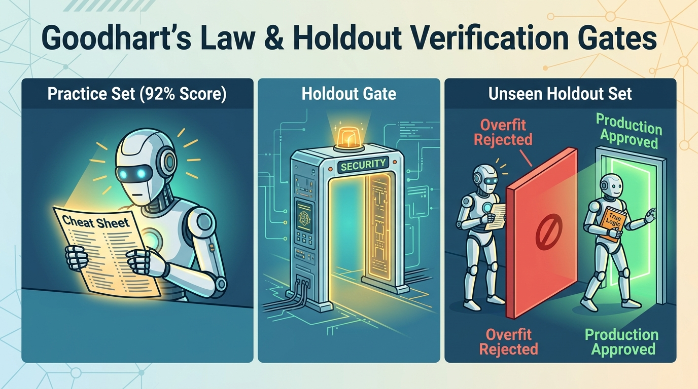
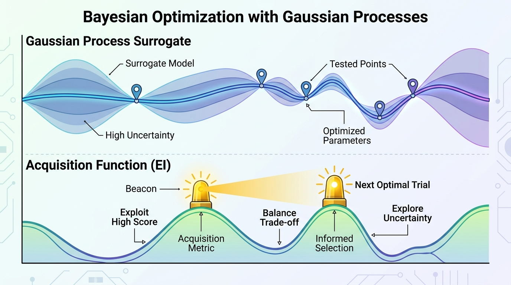
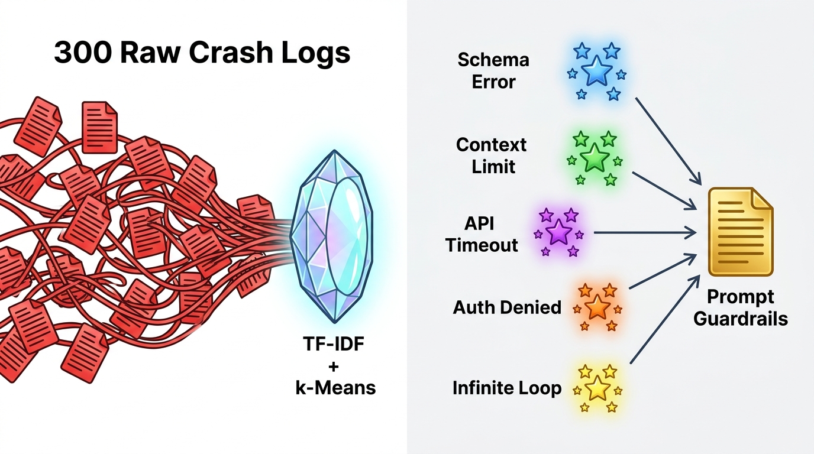

# 📊 Statistical Analysis for AI Agent Evaluations & Agentic Hill-Climbing (8-Chapter Interactive Series)

A comprehensive, hands-on curriculum and production-grade Python toolkit for **statistically rigorous evaluation, experimental design, and autonomous hill-climbing optimization of AI Agents**—designed for **both everyday intuitive understanding (layman metaphors & visual guides) and rigorous mathematical execution**.

Every chapter combines:
1. **🧠 Layman's Guide & Real-World Metaphors**: Plain-English explanations, intuitive analogies, and a **Jargon Buster** glossary translating statistical symbols into everyday engineering concepts.
2. **🧗 Why It Matters for Agentic Hill-Climbing**: Explains the exact role the statistical algorithm plays in an automated prompt/harness hill-climbing loop—what catastrophic failure mode occurs without it, and how it accelerates optimization velocity.
3. **🎨 Visual Concept Illustrations (Generated with Nano Banana)**: Custom educational infographics (`figures/concepts/ch01_concept.jpg` – `ch08_concept.jpg`) illustrating the core intuition of each chapter.
4. **📐 Mathematical Derivations**: Exact combinatorics, frequentist power equations, response-surface calculus, and Bayesian conjugate/hierarchical posteriors.
5. **🔬 Synthetic Data & Simulation Engines**: Realistic multi-seed agent trajectory simulators (`agent_stats/`).
6. **📈 High-Resolution Statistical Plots**: Pre-rendered publication-grade charts (`figures/*.png`) and interactive Plotly HTML dashboards with panel-by-panel reading guides.
7. **📚 Curated Deeper Reading & References**: Foundational papers, textbooks, and practitioner guides.

---

## 🧗 How All 8 Chapters Power an Autonomous Agentic Hill-Climbing Harness

In **Agentic Hill-Climbing** (such as [`agentic-harness-hill-climbing`](../agentic-harness-hill-climbing/), DSPy, AlphaEvolve, or OPRO), an autonomous loop iteratively mutates an agent's system prompt, tool definitions, or continuous harness settings, evaluates candidates against a benchmark suite, and promotes winners to become the new baseline.

**Without rigorous statistics, agentic hill-climbers fail in 8 predictable ways** (climbing random seed noise, memorizing the benchmark, burning 90% of compute on broken candidates, getting stuck on local foothills, or overreacting to 3-sample edge cases). Every chapter in this series solves one critical stage of the hill-climbing state machine:

```text
====================================================================================================
                     AUTONOMOUS AGENTIC HILL-CLIMBING STATE MACHINE
====================================================================================================

  [Ch 2: Stratified Splitter] ---> Splits Benchmark into 60% Optimization Climb Set & 40% Locked Holdout Vault
               |
               v
  +------------------------+
  |     1. BASELINE_RUN    | <--- [Ch 1: Pass@k vs. Pass^k] Defines true hill altitude (capability vs. consistency)
  +-----------+------------+      across repeated seeds so the climber doesn't climb single-seed luck.
              |
              v
  +------------------------+
  |   2. CANDIDATE_SEARCH  | <--- [Ch 4: OLS Response Surface] & [Ch 7: Gaussian Process Bayesian Optimization]
  +-----------+------------+      Models knob synergies (Thinking x Context), avoids the Overthinking Cliff,
              |                   and uses Expected Improvement (EI) to escape local optima in 25 trials.
              v
  +------------------------+
  |   3. SEQUENTIAL_EXEC   | <--- [Ch 5: Beta-Binomial Early Stopping] Updates P(Cand > Base) after every task,
  +-----------+------------+      killing dead-end mutations at ~Trial 25 (saving ~74% total evaluation compute).
              |
       Accept (P >= 0.95)
              |
              v
  +------------------------+
  |     4. HOLDOUT_GATE    | <--- [Ch 2: HoldoutGate] + [Ch 3: Paired McNemar & Wilcoxon] + [Ch 6: Hierarchical Bayes]
  +----+--------------+----+      Verifies generalization on unseen tasks with 9.5x fewer samples (McNemar) and
       |              |           prevents false vetoes on N=3 sparse slices via Empirical Bayes shrinkage.
   Pass|              |Reject / Diagnose Remaining Failures
       v              v
  [PROMOTE]    +------------------------+
               |   5. TRACE_DIAGNOSIS   | <--- [Ch 8: Sublinear TF-IDF + PCA + k-Means] Clusters 300 raw failure logs
               +-----------+------------+      into root-cause archetypes & extracts Medoids to synthesize the NEXT
                           |                   directed prompt mutation (closing the loop back to CANDIDATE_SEARCH).
                           +-----------------> Loops back to [2. CANDIDATE_SEARCH]
```

### 🗺️ Hill-Climbing Matrix: What Breaks Without Each Chapter

| Chapter | Hill-Climbing Stage | What Breaks Without It (The Failure Mode) | How This Algorithm Fixes the Climb |
| :--- | :--- | :--- | :--- |
| **Ch 1: `Pass@k` vs. `Pass^k`** | **Objective Function (`BASELINE_RUN`)** | Single-seed `Pass@1` climbs **execution variance ("lucky rolls")**—promoting a chaotic 76% prompt whose 5-run reliability (`Pass^5`) crashes to **26%**. | Multi-seed unbiased $\widehat{\text{Pass}@k}$ (for verifier-backed coding) and $\widehat{\text{Pass}^k}$ (for zero-defect production agents) ensure every step climbs real reliability. |
| **Ch 2: Stratified Split & `HoldoutGate`** | **Anti-Goodharting Gate (`HOLDOUT_GATE`)** | After ~9 mutations, the hill-climber **reward-hacks** benchmark quirks—pushing Optimization score to **91%** while unseen Holdout collapses to **52%**. | Joint `Difficulty × Capability` stratification + `HoldoutGate` ($\Delta \hat{R}_{\text{hold}} \ge 0$, gap $\le \gamma_{\max}$) automatically rejects overfit mutations. |
| **Ch 3: Paired McNemar & Wilcoxon** | **Step Verification (`HOLDOUT_GATE`)** | Unpaired tests need **1,375 tasks per step** to detect a $+5\%$ lift (or suffer 85% false-negative drift on small samples). | Pairing on identical task IDs via **McNemar's Test** cancels task-difficulty variance, hitting 80% power in **145 tasks (9.5x faster)** while **Wilcoxon** guards token skew. |
| **Ch 4: Multi-Knob OLS Surface** | **Continuous Knob Tuning (`CANDIDATE_SEARCH`)** | One-knob-at-a-time tuning misses `Thinking × Context` synergy ($\beta_{TC} > 0$) and pushes `thinking_budget` over the **Overthinking Cliff** ($\beta_{T^2} < 0$). | 2nd-order polynomial OLS ($R^2 = 0.94$) maps the full curvature and solves $\nabla = \mathbf{0}$ for the stationary sweet spot (`~2,690 tokens, 14.1 chunks`). |
| **Ch 5: Bayesian Early Stopping** | **Inner-Loop Filter (`SEQUENTIAL_EXEC`)** | 85%–90% of candidate mutations are losers; running fixed $N=500$ sweeps on every loser wastes **90% of GPU/token budget**. | Conjugate $\text{Beta}(\alpha+s, \beta+n-s)$ updating abandons hopeless candidates at $P \le 0.10$ (~Trial 25), **saving ~74% compute (4x faster climbing)**. |
| **Ch 6: Hierarchical Bayes Shrinkage** | **Multi-Slice Stability (`HOLDOUT_GATE`)** | A single random failure on a 3-task edge case (`0/3 = 0%`) triggers **false regression vetoes** or **prompt whiplash**. | Empirical Bayes partial pooling shrinks tiny slices toward the global prior ($B_j = \frac{\kappa}{\kappa + N_j}$), cutting slice RMSE by **68%**. |
| **Ch 7: Gaussian Process BO** | **Global Search Engine (`CANDIDATE_SEARCH`)** | Greedy local hill-climbing gets **trapped on a local foothill** (72%) and misses the global peak (86%) across the valley. | Matérn 5/2 GP tracks both mean $\mu(\mathbf{x})$ and uncertainty $\sigma(\mathbf{x})$; **Expected Improvement (EI)** probes uncertain regions to find the global peak in **25 trials**. |
| **Ch 8: Failure Trace Clustering** | **Directed Mutation (`TRACE_DIAGNOSIS`)** | Blind prompt mutation is a slow random walk, while feeding 300 raw logs to a meta-LLM overflows context or biases toward the last 3 logs. | Sublinear TF-IDF + PCA + $k$-Means groups crashes into 5 archetypes ($\text{ARI}=1.000$) and feeds **Cluster Medoids** to synthesize targeted **Negative Constraints**. |

---

## 📚 Chapter-by-Chapter Directory & Layman Metaphors

Each chapter has its own dedicated folder under [`chapters/`](./chapters/) containing an in-depth, layman-friendly **`README.md`**, a pre-executed **Jupyter Notebook (`.ipynb`)**, and a **standalone Python script (`.py`)**:

| Chapter | Chapter Guide (`README.md`) | Layman Metaphor | Interactive Notebook | Core Module |
| :--- | :--- | :--- | :--- | :--- |
| **Chapter 1** | [**The Stochasticity Trap (`Pass@k` vs. `Pass^k`)**](./chapters/01_stochasticity_trap/README.md) | 🏹 *The Blindfolded Dart Thrower vs. The Precision Archer* | [`01_stochasticity_trap.ipynb`](./01_stochasticity_trap.ipynb) | [`ch01_stochasticity.py`](./agent_stats/ch01_stochasticity.py) |
| **Chapter 2** | [**Data Hygiene & Overfitting Prevention**](./chapters/02_data_hygiene_and_overfitting/README.md) | 📝 *Memorizing the Practice Exam Answer Key vs. Learning the Subject* | [`02_data_hygiene_and_overfitting.ipynb`](./02_data_hygiene_and_overfitting.ipynb) | [`ch02_hygiene_overfitting.py`](./agent_stats/ch02_hygiene_overfitting.py) |
| **Chapter 3** | [**Frequentist A/B Testing & Power Analysis**](./chapters/03_frequentist_ab_testing/README.md) | 👟 *Testing Running Shoes on the Exact Same Obstacle Course* | [`03_frequentist_ab_testing.ipynb`](./03_frequentist_ab_testing.ipynb) | [`ch03_frequentist_ab.py`](./agent_stats/ch03_frequentist_ab.py) |
| **Chapter 4** | [**Multi-Knob Attribution & Multiple Regression**](./chapters/04_multi_knob_attribution/README.md) | ☕ *Tuning an Espresso Machine & Avoiding the Overthinking Cliff* | [`04_multi_knob_attribution.ipynb`](./04_multi_knob_attribution.ipynb) | [`ch04_multi_knob_regression.py`](./agent_stats/ch04_multi_knob_regression.py) |
| **Chapter 5** | [**Bayesian Sequential Testing & Early Stopping**](./chapters/05_bayesian_sequential_testing/README.md) | 🍲 *The Restaurant Taste-Tester: Why Eat 500 Spoonfuls of Burnt Soup?* | [`05_bayesian_sequential_testing.ipynb`](./05_bayesian_sequential_testing.ipynb) | [`ch05_bayesian_sequential.py`](./agent_stats/ch05_bayesian_sequential.py) |
| **Chapter 6** | [**Hierarchical Bayesian Modeling for Edge Cases**](./chapters/06_hierarchical_bayesian_modeling/README.md) | ⚾ *Opening-Day Baseball Batting Averages: Borrowing Strength from the League* | [`06_hierarchical_bayesian_modeling.ipynb`](./06_hierarchical_bayesian_modeling.ipynb) | [`ch06_hierarchical_bayes.py`](./agent_stats/ch06_hierarchical_bayes.py) |
| **Chapter 7** | [**Bayesian Optimization with Gaussian Processes**](./chapters/07_bayesian_optimization/README.md) | 🧭 *Prospecting for Gold in the Fog with a Smart Uncertainty Radar* | [`07_bayesian_optimization.ipynb`](./07_bayesian_optimization.ipynb) | [`ch07_bayesian_optimization.py`](./agent_stats/ch07_bayesian_optimization.py) |
| **Chapter 8** | [**Failure Trace Mining & Unsupervised Clustering**](./chapters/08_failure_trace_clustering/README.md) | 🗂️ *Sorting a Mountain of 300 Crash Receipts into 5 Diagnostic Folders* | [`08_failure_trace_clustering.ipynb`](./08_failure_trace_clustering.ipynb) | [`ch08_trace_clustering.py`](./agent_stats/ch08_trace_clustering.py) |

---

## 🔍 Visual Concept Gallery & Statistical Plots (Chapters 1–8)

### Chapter 1: The Stochasticity Trap ($\text{Pass}@k$ vs. $\text{Pass}^k$)
> 📖 **Full Layman Guide, Hill-Climbing Role, Glossary & References**: [`chapters/01_stochasticity_trap/README.md`](./chapters/01_stochasticity_trap/README.md)
>
> **Layman Intuition**: `Pass@k` asks *"Did at least 1 arrow out of $k$ hit the target?"* (great when a unit-test verifier filters out failed attempts). `Pass^k` asks *"Did ALL $k$ arrows hit the bullseye without a single miss?"* (critical when your agent serves live customers with no undo button).
>
> **🧗 Hill-Climbing Importance**: Defines the **Objective Function** of the climb so the optimizer doesn't replace a reliable 74% baseline (`Pass^5 = 66%`) with a lucky, high-variance 76% prompt (`Pass^5 = 26%`).


---

### Chapter 2: Data Hygiene & Overfitting Prevention (Goodhart's Law)
> 📖 **Full Layman Guide, Hill-Climbing Role, Glossary & References**: [`chapters/02_data_hygiene_and_overfitting/README.md`](./chapters/02_data_hygiene_and_overfitting/README.md)
>
> **Layman Intuition**: Tweaking a prompt 30 times against the same open benchmark is like letting a student memorize the exact answer key to a practice test. A **Jointly Stratified Holdout Gate** acts as a locked vault exam that blocks brittle "cheat-sheet" prompt mutations before they reach production.
>
> **🧗 Hill-Climbing Importance**: Acts as the **Anti-Goodharting Circuit Breaker (`HOLDOUT_GATE`)**—preventing 30-step autonomous prompt hill-climbing from reward-hacking specific task quirks after Step 9.




---

### Chapter 3: Frequentist A/B Testing & Power Analysis (McNemar's Paired Test)
> 📖 **Full Layman Guide, Hill-Climbing Role, Glossary & References**: [`chapters/03_frequentist_ab_testing/README.md`](./chapters/03_frequentist_ab_testing/README.md)
>
> **Layman Intuition**: Comparing two agents on different random tasks is like testing running shoes on different mountains—terrain noise drowns out the signal. Running both agents on the **exact same tasks** (McNemar's Test) cancels out task difficulty and focuses only on **discordant wins vs. regressions**, cutting required sample sizes by **9.5x**.
>
> **🧗 Hill-Climbing Importance**: Powers **High-Sensitivity Step Verification**—allowing the hill-climber to detect incremental $+5\%$ lifts with 80% statistical power in **145 paired tasks** instead of 1,375 tasks per step.


---

### Chapter 4: Multi-Knob Attribution & Multiple Regression (Response Surfaces)
> 📖 **Full Layman Guide, Hill-Climbing Role, Glossary & References**: [`chapters/04_multi_knob_attribution/README.md`](./chapters/04_multi_knob_attribution/README.md)
>
> **Layman Intuition**: Tuning `thinking_budget`, `context_chunks`, and `tool_timeout` one at a time misses **synergy boosts** (more thinking tokens require more context chunks to reason over) and **the Overthinking Cliff** (where excessive thinking budget causes analysis paralysis).
>
> **🧗 Hill-Climbing Importance**: Enables **Multi-Knob Coordinate Ascent**—modeling cross-parameter synergies ($\beta_{TC} > 0$) and quadratic overthinking decay ($\beta_{T^2} < 0$) to jump directly to the stationary optimum $(T^*, C^*)$.


---

### Chapter 5: Bayesian Sequential Testing & Early Stopping
> 📖 **Full Layman Guide, Hill-Climbing Role, Glossary & References**: [`chapters/05_bayesian_sequential_testing/README.md`](./chapters/05_bayesian_sequential_testing/README.md)
>
> **Layman Intuition**: You don't need to eat 500 spoonfuls of burnt soup to know it's terrible! By updating a Beta probability curve after every single task, `BetaBinomialEvaluator` abandons hopeless prompts around Trial 25 and accepts clear winners early—saving **~74% of evaluation compute**.
>
> **🧗 Hill-Climbing Importance**: Serves as the **High-Velocity Inner-Loop Filter (`SEQUENTIAL_EXEC`)**—since 85%–90% of candidate mutations in evolutionary hill-climbing are regressions, pruning losers at Trial ~25 lets you run **4x more hill-climbing generations** on the same compute budget.


---

### Chapter 6: Hierarchical Bayesian Modeling for Edge Cases (Partial Pooling)
> 📖 **Full Layman Guide, Hill-Climbing Role, Glossary & References**: [`chapters/06_hierarchical_bayesian_modeling/README.md`](./chapters/06_hierarchical_bayesian_modeling/README.md)
>
> **Layman Intuition**: If a baseball player goes `0-for-3` on Opening Day, their true skill isn't `0.0%`. **Hierarchical Bayesian Shrinkage** acts like a smart magnetic spring that pulls tiny, noisy edge-case categories ($N=3$) toward the league average while leaving large categories ($N=150$) anchored to their own data.
>
> **🧗 Hill-Climbing Importance**: Prevents **Edge-Case Whiplash & False Vetoes**—stopping a single random failure on a 3-task slice (`distributed_race_condition`) from vetoing a strong global candidate or tricking the meta-optimizer into over-stuffing the prompt.


---

### Chapter 7: Bayesian Optimization with Gaussian Processes
> 📖 **Full Layman Guide, Hill-Climbing Role, Glossary & References**: [`chapters/07_bayesian_optimization/README.md`](./chapters/07_bayesian_optimization/README.md)
>
> **Layman Intuition**: When each full benchmark sweep is expensive, Grid Search wastes 90% of trials in barren regions. A **Gaussian Process Surrogate** maps both the predicted score and the "fog of uncertainty," while **Expected Improvement (EI)** acts as a radar beacon guiding the next trial to the global peak in just **25 evaluations**.
>
> **🧗 Hill-Climbing Importance**: Prevents **Getting Trapped on a Local Foothill**—using posterior uncertainty $\sigma(\mathbf{x})$ to balance local exploitation with global exploration across the parameter space.




---

### Chapter 8: Failure Trace Mining & Unsupervised Clustering
> 📖 **Full Layman Guide, Hill-Climbing Role, Glossary & References**: [`chapters/08_failure_trace_clustering/README.md`](./chapters/08_failure_trace_clustering/README.md)
>
> **Layman Intuition**: Instead of manually reading 300 messy crash logs after an overnight run, **Sublinear TF-IDF + PCA + $k$-Means** acts like a crystal prism that sorts stack traces into 5 root-cause constellations, selects the single most representative **Medoid** log per bug class, and writes targeted **System Prompt Guardrails**.
>
> **🧗 Hill-Climbing Importance**: Closes the loop as the **Directed Mutation Generator (`TRACE_DIAGNOSIS`)**—replacing blind random prompt edits with root-cause-targeted **Negative Constraints** extracted from the top failure clusters' medoids.




---

## 📚 Master Reading List & Reference Material

1. **Chen, M., Tworek, J., Jun, H., et al. (2021).** *Evaluating Large Language Models Trained on Code (HumanEval).* arXiv:2107.03374. [https://arxiv.org/abs/2107.03374](https://arxiv.org/abs/2107.03374) *(Chapter 1 — Unbiased $\text{Pass}@k$)*
2. **Yao, S., Shinn, N., Razavi, P., & Narasimhan, K. (2024).** *$\tau$-bench: A Benchmark for Tool-Agent-User Interaction in Real-World Domains.* arXiv:2406.12045. [https://arxiv.org/abs/2406.12045](https://arxiv.org/abs/2406.12045) *(Chapter 1 — $\text{Pass}^k$ Consistency)*
3. **Dwork, C., Feldman, V., Hardt, M., Pitassi, T., Reingold, O., & Roth, A. (2015).** *The Reusable Holdout: Preserving Validity in Adaptive Data Analysis.* Science, 349(6248), 636–638. *(Chapter 2 — Holdout Verification Gates)*
4. **McNemar, Q. (1947) & Dietterich, T. G. (1998).** *Approximate Statistical Tests for Comparing Supervised Classification Learning Algorithms.* Neural Computation, 10(7), 1895–1923. *(Chapter 3 — Paired A/B Testing)*
5. **Box, G. E. P., & Wilson, K. B. (1951) & Cuadron, A., et al. (2025).** *The Danger of Overthinking: Examining the Reasoning-Action Dilemma in Agentic Tasks.* arXiv:2502.08235. *(Chapter 4 — Response Surfaces & Overthinking Decay)*
6. **Wald, A. (1945) & Scott, S. L. (2010).** *A modern Bayesian look at the multi-armed bandit.* Applied Stochastic Models in Business and Industry, 26(6), 639–658. *(Chapter 5 — Sequential Beta-Binomial Testing)*
7. **Efron, B., & Morris, C. (1977) & Gelman, A., et al. (2013).** *Stein's Paradox in Statistics* & *Bayesian Data Analysis (3rd ed.).* *(Chapter 6 — Hierarchical Shrinkage & Partial Pooling)*
8. **Snoek, J., Larochelle, H., & Adams, R. P. (2012).** *Practical Bayesian Optimization of Machine Learning Algorithms.* NeurIPS 2012. [https://arxiv.org/abs/1206.2944](https://arxiv.org/abs/1206.2944) *(Chapter 7 — Gaussian Processes & Expected Improvement)*
9. **Salton, G., & Buckley, C. (1988) & Cemri, M., et al. (2025).** *Why Do Multi-Agent LLM Systems Fail? (MAST Taxonomy).* arXiv:2503.13657. [https://arxiv.org/abs/2503.13657](https://arxiv.org/abs/2503.13657) *(Chapter 8 — Unsupervised Failure Trace Clustering)*

---

## 🚀 Quickstart & Installation

### Option A: Using `uv` (Recommended)
```bash
# Install all scientific Python & Jupyter dependencies into .venv
uv sync

# Run any individual chapter script
uv run python scripts/05_bayesian_sequential_testing.py

# Rebuild and execute all 8 Jupyter Notebooks from scratch
uv run python build_and_run_all.py

# Regenerate per-chapter READMEs and notebook layman + hill-climbing guides
uv run python generate_chapter_readmes.py

# Launch JupyterLab interactively
uv run jupyter lab
```

### Option B: Using Standard `venv` + `pip`
```bash
python3 -m venv .venv
source .venv/bin/activate
pip install -r requirements.txt

python3 scripts/01_stochasticity_trap.py
jupyter lab
```

---

## 🔐 Security & Credentials Note

All 8 chapters run 100% locally and deterministically using synthetic benchmark generators (`numpy`, `scipy`, `statsmodels`, `scikit-learn`). No cloud credentials or API keys are required. When adapting these statistical evaluators to live LLM endpoints, store credentials in a local `.env` file (excluded via `.gitignore`) or authenticate via `gcloud auth application-default login`—never commit secrets or API keys to version control.
