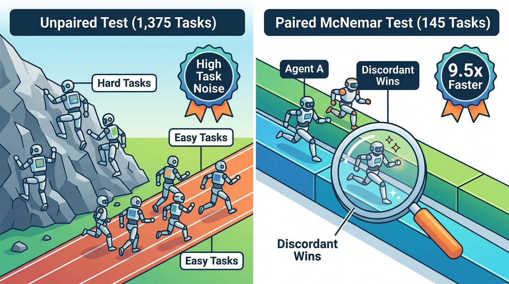

# Chapter 3: Frequentist A/B Testing & Power Analysis

Implements rigorous paired A/B testing (`McNemar's Test` for binary pass/fail outcomes and `Wilcoxon Signed-Rank Test` for skewed token/latency metrics) alongside statistical power analysis.

---

## 🎨 Visual Concept Overview (Generated with Nano Banana)



---

## 🧠 Layman's Guide: Testing Running Shoes on the Exact Same Obstacle Course vs. Different Mountains

Imagine you want to know if a new running shoe (**Shoe B**) makes runners 5% faster than the old shoe (**Shoe A**):

- **The Unpaired Way (Two-Sample $Z$-Test)**: You send 100 people wearing Shoe A up a steep, rocky mountain in the rain, and 100 different people wearing Shoe B down a flat paved track in the sun. Because the terrain (task difficulty) varies wildly from person to person, the "terrain noise" drowns out the 5% shoe difference. You would need **1,375 runners per group** to be sure!
- **The Paired Way (McNemar's Test)**: You have the **exact same runner** run the **exact same obstacle block** once in Shoe A and once in Shoe B.
  - If an obstacle is super easy and they pass in both shoes $(a)$, that tells us nothing about which shoe is better—we cross it out!
  - If an obstacle is impossible and they fail in both shoes $(d)$, we cross that out too!
  - We put a magnifying glass **only on the tasks where the two agents disagreed**: where Shoe B passed and Shoe A failed ($c$, a win), versus where Shoe A passed and Shoe B failed ($b$, a regression).

### Why This Matters for AI Agents
In agent benchmarks, running both your Baseline Agent and Candidate Agent on the **exact same list of benchmark tasks** is free! By using **McNemar's Paired Test** instead of a standard unpaired A/B calculator, you cancel out task-difficulty noise and need **9.5x fewer evaluation tasks** (145 tasks instead of 1,375) to prove a 5% improvement with 80% statistical power!

---

## 🧗 Why This Matters for Agentic Hill-Climbing

> **Role in the Optimization Loop**: **Stage 3 — High-Sensitivity Step Verification (Detecting Incremental $+3\%$ to $+5\%$ Lifts)**

In **Agentic Hill-Climbing**, individual prompt or tool mutations rarely jump accuracy by $+30\%$ in a single bound; real progress happens through **steady $+3\%$ to $+5\%$ incremental steps** compounded over 10–20 iterations. This creates a massive statistical dilemma at every step of the climb:

- **What Breaks Without It (Blind Drift or 10x Compute Bloat)**:
  - If you use an **unpaired 2-sample $Z$-test** to verify whether a $+5\%$ candidate mutation is statistically significant ($p < 0.05$ at $80\%$ power), task-difficulty variance forces you to run **~1,375 tasks per candidate**—making a 25-step hill-climb cost over **34,000 task evaluations**!
  - Conversely, if you only run 150 tasks *without* paired testing, your statistical power drops below **15%**, meaning the hill-climber rejects 85% of genuinely good mutations and wanders randomly!
- **How It Supercharges the Hill-Climber**:
  1. **McNemar's Paired Test on Discordant Tasks ($b$ vs. $c$)** conditions on exact task IDs, canceling out shared task-difficulty variance and achieving $80\%$ power in **~145 paired tasks (a 9.5x reduction in sample size per hill-climbing step)**.
  2. **Wilcoxon Signed-Rank Guardrail for Cost/Latency**: Ensures a candidate prompt that passes McNemar's accuracy test isn't secretly achieving that lift by exploding median token consumption or getting stuck in heavy-tailed retry loops.

---

## 📖 Plain-English Terminology & Jargon Buster

| Term / Symbol | Plain-English Meaning |
| :--- | :--- |
| **Statistical Power ($1 - \beta$)** | The probability (typically set to 80%) that your experiment will successfully detect a real improvement if one actually exists. |
| **Significance Level ($\alpha$)** | The false-positive risk (typically 5%, or $p < 0.05$)—the chance of claiming a prompt is better when it was just a lucky coin flip. |
| **Concordant Pairs ($a$ and $d$)** | Tasks where both Baseline and Candidate passed ($a$) or both failed ($d$). They tie and provide zero signal about which agent is better. |
| **Discordant Pairs ($b$ and $c$)** | The 'tie-breaker' tasks! $b$ = regressions (Baseline passed, Candidate failed); $c$ = new wins (Baseline failed, Candidate passed). |
| **McNemar's Test** | A statistical test for paired pass/fail data that compares new wins ($c$) against regressions ($b$) on the exact same task set. |
| **Wilcoxon Signed-Rank Test** | A paired test for continuous numbers (like token cost or latency) that ranks differences instead of averaging them, so one huge 50,000-token outlier doesn't ruin your test. |

---

## 📐 Mathematical Formulation (Step-by-Step)

- **McNemar's Paired Test with Edwards' Continuity Correction**:
  $$\chi^2_{\text{McNemar}} = \frac{(|b - c| - 1)^2}{b + c} \sim \chi^2_1$$
  where $b$ is the count of regressions (Baseline Pass, Candidate Fail) and $c$ is the count of newly solved tasks (Baseline Fail, Candidate Pass).
- **Paired Sample Size Formula (Connor, 1987)**:
  $$N_{\text{paired}} = \frac{\left(z_{1-\alpha/2}\sqrt{\psi} + z_{1-\beta}\sqrt{\psi - \Delta^2}\right)^2}{\Delta^2}, \qquad \psi = p_b + p_c, \quad \Delta = p_c - p_b$$
  Because task outcomes are strongly correlated across identical tasks, the discordant fraction $\psi = p_b + p_c$ is much smaller than the unpaired variance $p_1(1-p_1) + p_2(1-p_2)$.

---

## ✨ Key Implementation & Simulation Highlights

- `calculate_required_sample_size`: Computes required task counts for both unpaired 2-sample $Z$-tests and paired McNemar tests.
- **1,000-Trial Monte Carlo Power Benchmark**: Proves that detecting a $+5\%$ pass rate lift ($65\% \to 70\%$) at $80\%$ power requires **~145 paired tasks** with McNemar's test versus **~1,375 tasks per arm** with an unpaired $Z$-test (**9.5x sample reduction**).
- Applies the non-parametric **Wilcoxon Signed-Rank Test** to heavy-tailed log-normal token consumption distributions.

---

## 📊 Generated Statistical Visualization & How to Read It


### 🔍 How to Read This Chart (Panel-by-Panel)
- **Left Panel (Statistical Power vs. Sample Size)**: Compare how steep the blue curve (**Paired McNemar Test**) climbs compared to the orange curve (**Unpaired 2-Sample Z-Test**). McNemar hits the 80% power line at just $N=145$ tasks, while the unpaired test needs $N=1,375$ tasks!
- **Center Panel ($2\times 2$ Contingency Table)**: Shows a 300-task experiment. Most tasks sit in the green diagonal ("Both Pass: 185" and "Both Fail: 78"). McNemar zooms in exclusively on the off-diagonal boxes: **31 New Wins ($c$)** vs. **6 Regressions ($b$)**, yielding $p = 0.00007$.
- **Right Panel (Skewed Token Distribution)**: Token usage in agents has a long "heavy tail" when an agent gets stuck in a retry loop. The Wilcoxon test cleanly detects the median token reduction without getting skewed by extreme outliers.

---

## 🚀 How to Run This Chapter

### 1. Interactive Jupyter Notebook
Open [`03_frequentist_ab_testing.ipynb`](./03_frequentist_ab_testing.ipynb) (pre-executed with all outputs, layman guides, and plots embedded) or launch JupyterLab from the repository root:
```bash
uv run jupyter lab chapters/03_frequentist_ab_testing/03_frequentist_ab_testing.ipynb
```

### 2. Standalone Python Script
Run the standalone script from the repository root:
```bash
uv run python chapters/03_frequentist_ab_testing/03_frequentist_ab_testing.py
```

### 3. Reusable Package Module
Import directly from [`agent_stats/ch03_frequentist_ab.py`](../../agent_stats/ch03_frequentist_ab.py):
```python
import agent_stats
```

---

## 📚 Resources & Reference Material for Deeper Reading

1. **McNemar, Q. (1947).** *Note on the sampling error of the difference between correlated proportions or percentages.* Psychometrika, 12(2), 153–157. [https://doi.org/10.1007/BF02295996](https://doi.org/10.1007/BF02295996)
2. **Dietterich, T. G. (1998).** *Approximate Statistical Tests for Comparing Supervised Classification Learning Algorithms.* Neural Computation, 10(7), 1895–1923. — Classic machine learning paper demonstrating why McNemar's test is ideal for expensive benchmark evaluations.
3. **Dror, R., Baumer, G., Shlomov, S., & Reichart, R. (2018).** *The Hitchhiker's Guide to Testing Statistical Significance in Natural Language Processing.* ACL 2018. [https://aclanthology.org/P18-1128/](https://aclanthology.org/P18-1128/)
4. **Wilcoxon, F. (1945).** *Individual Comparisons by Ranking Methods.* Biometrics Bulletin, 1(6), 80–83.
