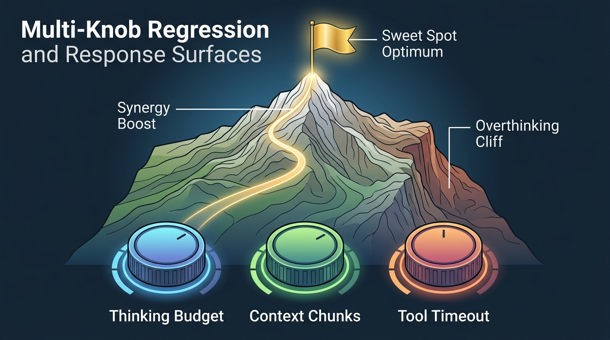
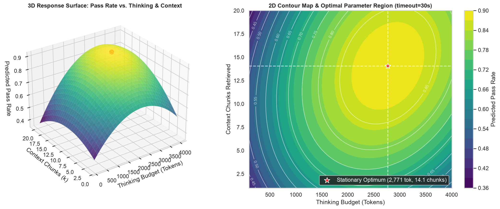

# Chapter 4: Multi-Knob Attribution & Multiple Regression

Fits a second-order polynomial response surface (`statsmodels` Formula OLS) across three continuous agent harness knobs (`thinking_budget`, `context_chunks`, `tool_timeout`) to isolate linear gains, quadratic overthinking decay, and parameter interaction synergies.

---

## 🎨 Visual Concept Overview (Generated with Nano Banana)



---

## 🧠 Layman's Guide: Tuning an Espresso Machine & Avoiding the 'Overthinking Cliff'

Imagine tuning three dials on a high-end espresso machine—**Water Temperature**, **Grind Size**, and **Brew Pressure**—or adjusting dials on a studio mixing board:

1. **Diminishing Returns & The Overthinking Cliff (Quadratic Term $eta_{T^2} < 0$)**: Adding a little more coffee or brewing a little longer makes the espresso richer. But if you keep turning the dial to the maximum, you burn the coffee! Similarly, giving an AI agent more **Thinking Budget** helps up to ~2,700 tokens, but beyond that, the agent enters **"analysis paralysis"** (second-guessing itself, hallucinating edge cases, and degrading accuracy).
2. **Synergy Boost (Interaction Term $eta_{TC} > 0$)**: What happens if you give an agent a massive **Thinking Budget** ($T$), but only 1 **Context Chunk** ($C$) of documentation? It has plenty of brainpower, but nothing to read! Conversely, if you dump 20 chunks of documentation into the prompt with almost zero thinking budget, it can't synthesize them. Only when you turn **both dials up together** ($T 	imes C$) do you unlock a synergy bonus.

### Why This Matters for AI Agents
Most engineers tune one knob at a time ("Let's set `thinking_budget=4000` and see what happens"). One-at-a-time tuning misses interactions and wastes money on over-allocated tokens. **Response Surface Methodology (RSM)** maps the entire 3D mountain peak so you can find the exact mathematical sweet spot.

---

## 📖 Plain-English Terminology & Jargon Buster

| Term / Symbol | Plain-English Meaning |
| :--- | :--- |
| **Response Surface Methodology (RSM)** | Fitting a smooth curved 3D surface (like a topographic mountain map) to experimental data so you can locate the highest performance peak. |
| **Linear Effect ($\beta_T, \beta_C$)** | The initial upward slope—how much pass rate improves per unit when you first start increasing a knob. |
| **Quadratic Decay ($\beta_{T^2}, \beta_{C^2}$)** | The curvature ($T^2$) that bends the line downward into an upside-down U-shape (parabola), capturing diminishing returns and 'overthinking'. |
| **Interaction Term ($\beta_{TC} \cdot T \cdot C$)** | Measures **synergy**: when two knobs together produce a bigger boost than the sum of turning each knob alone. |
| **Stationary Optimum ($T^*, C^*$)** | The exact coordinates of the mountain peak where the slope flattens out to zero ($\nabla = 0$) before curving downward. |
| **$R^2$ (Coefficient of Determination)** | The percentage of variation in pass rates explained by our regression equation (here, $94.2\%$). |

---

## 📐 Mathematical Formulation (Step-by-Step)

- **Second-Order Response Surface Model**:
  $$\text{PassRate} = \beta_0 + \underbrace{\beta_T T + \beta_C C + \beta_S S}_{\text{Linear Main Effects}} + \underbrace{\beta_{T^2} T^2 + \beta_{C^2} C^2}_{\text{Quadratic Decay (Overthinking)}} + \underbrace{\beta_{TC}(T \cdot C)}_{\text{Synergy Interaction}} + \epsilon$$
- **Finding the Sweet Spot Peak $(T^*, C^*)$ via First-Order Partial Derivatives**:
  Setting $\frac{\partial \text{PassRate}}{\partial T} = 0$ and $\frac{\partial \text{PassRate}}{\partial C} = 0$ gives a $2\times 2$ linear system:
  $$\begin{bmatrix} 2\beta_{T^2} & \beta_{TC} \\ \beta_{TC} & 2\beta_{C^2} \end{bmatrix} \begin{bmatrix} T^* \\ C^* \end{bmatrix} = \begin{bmatrix} -\beta_T \\ -\beta_C \end{bmatrix}$$

---

## ✨ Key Implementation & Simulation Highlights

- Fits a full quadratic + interaction OLS regression ($R^2 = 0.94$) with $t$-statistics, $p$-values, and confidence intervals.
- Renders 3D surface plots and 2D iso-performance contour maps pinpointing the stationary optimum (~2,690 thinking tokens, ~14.1 context chunks).
- Automatically extracts plain-English developer insights quantifying the marginal efficiency loss per 100 tokens past the overthinking threshold.

---

## 📊 Generated Statistical Visualization & How to Read It



### 🔍 How to Read This Chart (Panel-by-Panel)
- **Left Panel (3D Response Surface)**: Look at the curved mountain surface. Notice how moving from left to right along `Thinking Budget` climbs steeply up to ~2,690 tokens (marked by the red star) and then **curves downward**—that downward slope on the right is the "Overthinking Cliff."
- **Right Panel (2D Topographic Contour Map)**: Just like a hiker's elevation map, the concentric rings show equal pass-rate zones. The bright yellow-green center with the red star (`Optimum: 2690 tok, 14.1 chunks`) shows the exact harness configuration that maximizes accuracy (~86%) without wasting tokens.

---

## 🚀 How to Run This Chapter

### 1. Interactive Jupyter Notebook
Open [`04_multi_knob_attribution.ipynb`](./04_multi_knob_attribution.ipynb) (pre-executed with all outputs, layman guides, and plots embedded) or launch JupyterLab from the repository root:
```bash
uv run jupyter lab chapters/04_multi_knob_attribution/04_multi_knob_attribution.ipynb
```

### 2. Standalone Python Script
Run the standalone script from the repository root:
```bash
uv run python chapters/04_multi_knob_attribution/04_multi_knob_attribution.py
```

### 3. Reusable Package Module
Import directly from [`agent_stats/ch04_multi_knob_regression.py`](../../agent_stats/ch04_multi_knob_regression.py):
```python
import agent_stats
```

---

## 📚 Resources & Reference Material for Deeper Reading

1. **Box, G. E. P., & Wilson, K. B. (1951).** *On the Experimental Attainment of Optimum Conditions.* Journal of the Royal Statistical Society: Series B, 13(1), 1–38. — The foundational paper introducing Response Surface Methodology (RSM).
2. **Montgomery, D. C. (2019).** *Design and Analysis of Experiments (10th ed.).* Wiley.
3. **Cuadron, A., et al. (2025).** *The Danger of Overthinking: Examining the Reasoning-Action Dilemma in Agentic Tasks.* arXiv:2502.08235. [https://arxiv.org/abs/2502.08235](https://arxiv.org/abs/2502.08235) — Empirical study showing how excessive reasoning budgets degrade agent task performance.
