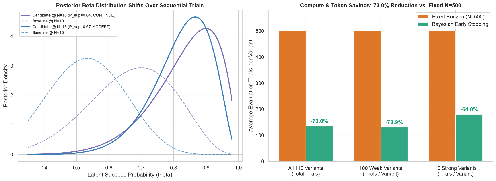

# Chapter 5: Bayesian Sequential Testing & Early Stopping

Implements conjugate Beta-Binomial posterior updating and sequential early stopping (`BetaBinomialEvaluator`) to prune weak prompt candidates early and accept strong winners without running fixed $N=500$ sweeps.

---

## 📐 Mathematical Formulation

- **Closed-Form Conjugate Posterior Update**:
  $$\theta \mid (s, n) \sim \text{Beta}(\alpha_0 + s, \, \beta_0 + n - s)$$
- **Posterior Probability of Superiority**:
  $$P(\theta_{\text{cand}} > \theta_{\text{base}} \mid D) = \int_0^1 f_{\text{Beta}}(x; \alpha_C, \beta_C) F_{\text{Beta}}(x; \alpha_B, \beta_B) \, dx$$

---

## ✨ Key Implementation Highlights

- Computes $P(\theta_{\text{cand}} > \theta_{\text{base}} \mid D)$ via both **exact 1D numerical quadrature** (`scipy.integrate.quad`) and **Monte Carlo sampling** (`numpy`).
- `BetaBinomialEvaluator`: Stateful step-by-step evaluator with configurable boundaries (`ACCEPT` at $P \ge 0.95$, `ABANDON` at $P \le 0.10$, else `CONTINUE`).
- **Compute-Savings Benchmark**: Across 100 weak variants and 10 strong variants, Bayesian early stopping reduces total evaluation trials by **~74%** compared to fixed $N=500$ sweeps.

---

## 📊 Generated Visualization



---

## 🚀 How to Run This Chapter

### 1. Interactive Jupyter Notebook
Open [`05_bayesian_sequential_testing.ipynb`](./05_bayesian_sequential_testing.ipynb) (pre-executed with all outputs and plots embedded) or launch JupyterLab from the repository root:
```bash
uv run jupyter lab chapters/05_bayesian_sequential_testing/05_bayesian_sequential_testing.ipynb
```

### 2. Standalone Python Script
Run the standalone script from the repository root:
```bash
uv run python chapters/05_bayesian_sequential_testing/05_bayesian_sequential_testing.py
```

### 3. Reusable Package Module
Import directly from [`agent_stats/ch05_bayesian_sequential.py`](../../agent_stats/ch05_bayesian_sequential.py):
```python
import agent_stats
```
