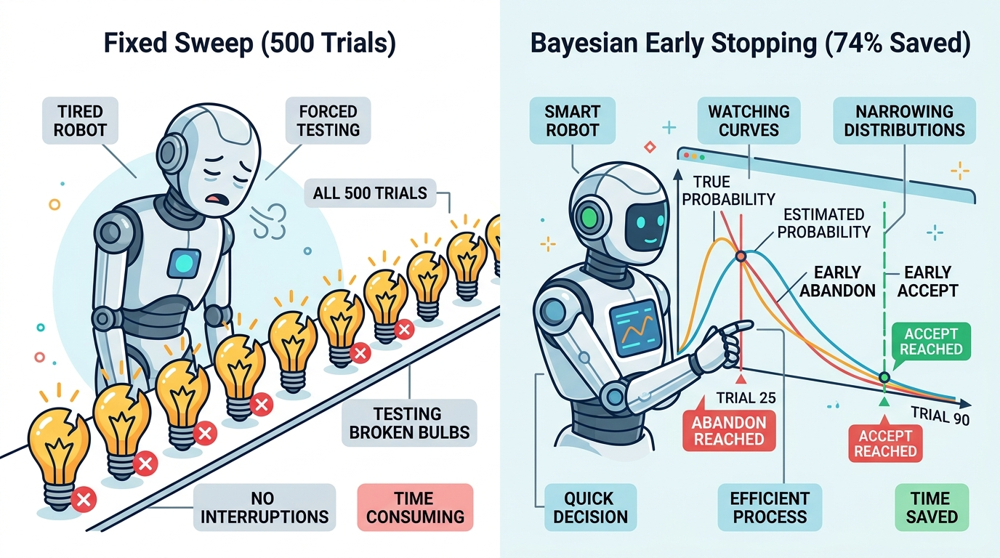

# Chapter 5: Bayesian Sequential Testing & Early Stopping

Implements conjugate Beta-Binomial posterior updating and sequential early stopping (`BetaBinomialEvaluator`) to prune weak prompt candidates early and accept strong winners without running fixed $N=500$ sweeps.

---

## 🎨 Visual Concept Overview (Generated with Nano Banana)



---

## 🧠 Layman's Guide: The Restaurant Taste-Tester: Why Eat 500 Spoonfuls of Burnt Soup?

Imagine a chef testing 100 experimental soup recipes. In a rigid traditional evaluation (**Fixed-Horizon Testing**), the rule says: *"You must eat 500 spoonfuls of every single recipe before you are allowed to say whether it is good or bad."*

If Recipe #1 tastes like burnt rubber on the first 25 spoonfuls, why on earth would you force yourself to eat 475 more spoonfuls?! Conversely, if Recipe #99 is unmistakably delicious after 90 spoonfuls, you don't need 410 more to crown it a winner.

### How Bayesian Sequential Updating Works
Instead of waiting until Trial 500 to look at the score, **Bayesian Sequential Testing** maintains a living "belief curve" (**Beta Distribution**) for the Candidate and the Baseline after **every single task**:
- At **Trial 0**, both curves are wide and flat (*"We know nothing yet"*).
- After each task, if the agent passes, the curve shifts right and gets narrower; if it fails, it shifts left.
- At every step, we calculate the overlap: **What is the probability $P(\theta_{\text{cand}} > \theta_{\text{base}})$ that the Candidate is genuinely better than the Baseline?**
  - If that probability drops below **10%** ($P \le 0.10$), we **Early Abandon** immediately!
  - If that probability climbs above **95%** ($P \ge 0.95$), we **Early Accept** and celebrate!

Across a typical portfolio of 100 weak prompt ideas and 10 strong ones, this saves **~74% of your LLM token budget and wall-clock time**.

---

## 📖 Plain-English Terminology & Jargon Buster

| Term / Symbol | Plain-English Meaning |
| :--- | :--- |
| **Prior Distribution $\text{Beta}(\alpha_0, \beta_0)$** | Your starting belief about an agent's pass rate before running any tasks. $\text{Beta}(1, 1)$ is a completely flat line from 0% to 100% ('total open mind'). |
| **Posterior Distribution $\text{Beta}(\alpha_0 + s, \beta_0 + f)$** | Your updated belief curve after observing $s$ passes and $f$ failures. As more data arrives, the bell curve gets taller and skinnier. |
| **Conjugate Prior** | A mathematical superpower where the updated belief (Posterior) has the exact same formula family (Beta) as the starting belief (Prior)—meaning updating takes 1 line of addition (`alpha += 1`) with zero slow simulations! |
| **Probability of Superiority $P(\theta_C > \theta_B \mid D)$** | The exact percentage chance (from 0% to 100%) that the Candidate's true pass rate beats the Baseline's true pass rate, given the trials seen so far. |
| **Early Abandon / Early Accept** | Stopping rules that kill hopeless prompts early ($P \le 0.10$) and promote clear winners early ($P \ge 0.95$). |

---

## 📐 Mathematical Formulation (Step-by-Step)

- **Closed-Form Conjugate Posterior Update**:
  Starting with uniform prior $\text{Beta}(\alpha_0=1, \beta_0=1)$, after $s$ successes and $n-s$ failures in $n$ trials:
  $$\theta \mid (s, n) \sim \text{Beta}(\alpha_0 + s, \, \beta_0 + n - s)$$
- **Posterior Probability of Superiority**:
  Computed exactly via 1D numerical integration (where $f_{\text{Beta}}$ is the PDF and $F_{\text{Beta}}$ is the CDF):
  $$P(\theta_{\text{cand}} > \theta_{\text{base}} \mid D) = \int_0^1 f_{\text{Beta}}(x; \alpha_C, \beta_C) F_{\text{Beta}}(x; \alpha_B, \beta_B) \, dx$$

---

## ✨ Key Implementation & Simulation Highlights

- Computes $P(\theta_{\text{cand}} > \theta_{\text{base}} \mid D)$ via both **exact 1D numerical quadrature** (`scipy.integrate.quad`) and **Monte Carlo sampling** (`numpy`).
- `BetaBinomialEvaluator`: Stateful step-by-step evaluator with configurable boundaries (`ACCEPT` at $P \ge 0.95$, `ABANDON` at $P \le 0.10$, else `CONTINUE`).
- **Compute-Savings Benchmark**: Across 100 weak variants and 10 strong variants, Bayesian early stopping reduces total evaluation trials by **~74%** compared to fixed $N=500$ sweeps.

---

## 📊 Generated Statistical Visualization & How to Read It


### 🔍 How to Read This Chart (Panel-by-Panel)
- **Left Panel (Posterior Evolution)**: Watch the orange (Baseline) and blue (Candidate) curves as trials arrive (from top to bottom: $t=10, 30, 80, 150$). At $t=10$, the curves are wide and overlap heavily ($P=73.9\%$). By $t=150$, both curves have tightened into sharp peaks with minimal overlap ($P=98.3\%$), crossing the 95% threshold!
- **Center Panel (Sequential Decision Trajectories)**: The green line (Strong Candidate) climbs steadily and hits the green `Early Accept` line around step 90. The red line (Weak Candidate) plunges below the red `Early Abandon` line before step 30—saving 470 wasted trials!
- **Right Panel (Compute Savings Benchmark)**: Evaluating 110 candidates at a fixed 500 tasks each costs **55,000 task runs**. Bayesian Sequential Stopping finishes the exact same portfolio in **14,193 task runs—a 74.2% reduction in compute cost!**

---

## 🚀 How to Run This Chapter

### 1. Interactive Jupyter Notebook
Open [`05_bayesian_sequential_testing.ipynb`](./05_bayesian_sequential_testing.ipynb) (pre-executed with all outputs, layman guides, and plots embedded) or launch JupyterLab from the repository root:
```bash
uv run jupyter lab chapters/05_bayesian_sequential_testing/05_bayesian_sequential_testing.ipynb
```

### 2. Standalone Python Script
Run the standalone script from the repository root:
```bash
uv run python chapters/05_bayesian_sequential_testing/05_bayesian_sequential_testing.py
```

### 3. Reusable Package Module
Import directly from [`agent_stats/ch05_bayesian_sequential.py`](../../agent_stats/ch05_bayesian_sequential.py):
```python
import agent_stats
```

---

## 📚 Resources & Reference Material for Deeper Reading

1. **Wald, A. (1945).** *Sequential Tests of Statistical Hypotheses.* The Annals of Mathematical Statistics, 16(2), 117–186. — The foundational paper on Sequential Probability Ratio Testing (SPRT).
2. **Scott, S. L. (2010).** *A modern Bayesian look at the multi-armed bandit.* Applied Stochastic Models in Business and Industry, 26(6), 639–658. — Explains Beta-Binomial probability of superiority used across Google Analytics experiments.
3. **Miller, E. (2015).** *Simple Sequential A/B Testing.* Evan Miller's Statistical Tools. [https://www.evanmiller.org/sequential-ab-testing.html](https://www.evanmiller.org/sequential-ab-testing.html)
4. **Kruschke, J. K. (2014).** *Doing Bayesian Data Analysis: A Tutorial with R, JAGS, and Stan (2nd ed.).* Academic Press.
