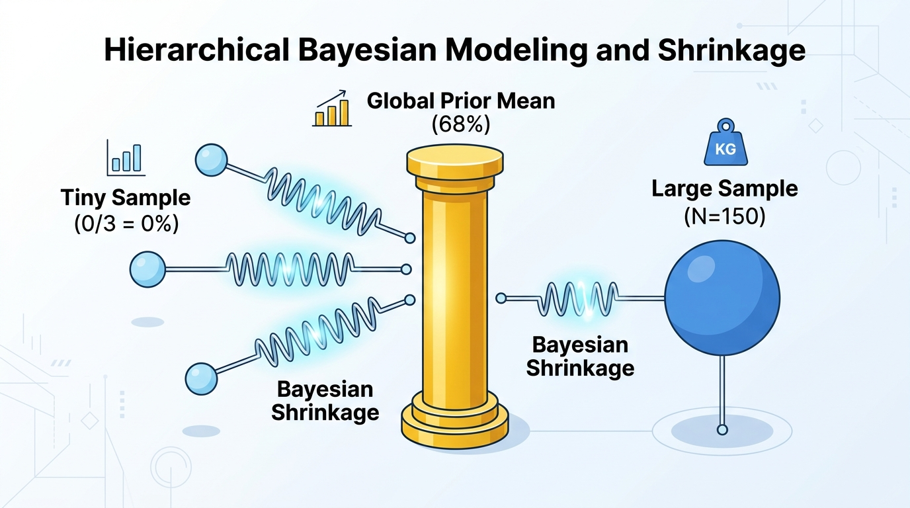

# Chapter 6: Hierarchical Bayesian Modeling for Edge Cases

Demonstrates Empirical Bayes partial pooling and shrinkage across 8 agent failure categories with uneven sample sizes ($N_j \in [3, 150]$), preventing false regression panic on sparse edge-case slices.

---

## 🎨 Visual Concept Overview (Generated with Nano Banana)



---

## 🧠 Layman's Guide: The Opening-Day Baseball Batting Average: Borrowing Strength from the League

Imagine it is Opening Day of the baseball season. A rookie steps up to the plate 3 times and strikes out all 3 times ($0 / 3 = 0.000$ batting average).

- **No Pooling (Panic Mode)**: Looking only at those 3 swings, a naive manager screams: *"His true skill is 0%! Cut him from the roster immediately!"*
- **Complete Pooling (Blind Mode)**: Ignoring the 3 strikeouts completely and saying: *"Every player in Major League Baseball bats .260, so he is a .260 hitter."*
- **Partial Pooling / Bayesian Shrinkage (The Smart Scout)**: A seasoned scout says: *"Three swings is tiny evidence. Since the league average is .260, my best estimate of his true skill right now is pulled (shrunk) strongly toward the league average—around .235. Once he has 150 at-bats, we'll trust his personal stats almost completely."*

### Why This Matters for AI Agents
When you slice an agent benchmark into fine-grained failure categories (e.g., `sql_generation` with $N=150$ tasks vs. `distributed_race_condition` with only $N=3$ tasks), a single unlucky failure in a 3-task category drops the raw pass rate by **33%**! Without **Hierarchical Bayesian Shrinkage**, engineering teams waste days chasing phantom "0% pass rate" emergencies in tiny categories that are just small-sample noise.

---

## 📖 Plain-English Terminology & Jargon Buster

| Term / Symbol | Plain-English Meaning |
| :--- | :--- |
| **No Pooling ($S_j / N_j$)** | Calculating each category's pass rate in total isolation. Highly accurate for huge categories ($N=150$), wildly noisy for tiny categories ($N=3$). |
| **Complete Pooling** | Lumping all tasks together into one global average ($68.2\%$), ignoring real differences between easy and hard categories. |
| **Partial Pooling (Hierarchical Bayes)** | The gold-standard compromise: each category gets a weighted blend between its own raw score and the global average, weighted by how much data ($N_j$) it has. |
| **Shrinkage Factor ($B_j = \frac{\kappa}{\kappa + N_j}$)** | The 'magnetic pull' toward the global average. When sample size $N_j=3$ is tiny, $B_j \approx 83\%$ (strong pull to the global mean). When $N_j=150$ is huge, $B_j \approx 9\%$ (stays anchored to its own data). |
| **Hyperprior ($\mu_0, \kappa$)** | The overarching 'league average' ($\mu_0$) and consistency strength ($\kappa$) learned automatically across all categories. |
| **Credible Interval (95% CI)** | The horizontal error bar showing the 95% likely range of a category's true pass rate. |

---

## 📐 Mathematical Formulation (Step-by-Step)

- **Two-Level Hierarchical Beta-Binomial Model**:
  $$\theta_j \sim \text{Beta}(\alpha_0, \beta_0), \qquad S_j \mid \theta_j \sim \text{Binomial}(N_j, \theta_j)$$
- **Posterior Shrinkage Formula (Weighted Average of Global Prior and Local Data)**:
  $$\mathbb{E}[\theta_j \mid S_j, N_j] = \underbrace{\left(\frac{\kappa}{\kappa + N_j}\right)}_{B_j \text{ (Shrinkage Weight)}} \mu_0 + (1 - B_j)\left(\frac{S_j}{N_j}\right), \qquad \kappa = \alpha_0 + \beta_0$$
  Notice how as $N_j \to 0$, $B_j \to 1$ (estimate equals the global mean $\mu_0$). As $N_j \to \infty$, $B_j \to 0$ (estimate equals the raw category rate $S_j/N_j$).

---

## ✨ Key Implementation & Simulation Highlights

- Compares **No Pooling** ($S_j/N_j$), **Complete Pooling** ($\sum S_j / \sum N_j$), and **Partial Pooling** (Empirical Bayes marginal likelihood maximization).
- Demonstrates how `distributed_race_condition` ($N=3, S=0$, raw $0.0\%$) and `memory_leak` ($N=4, S=1$, raw $25.0\%$) are shrunk toward the population hyperprior mean ($56.8\%$ and $59.9\%$).
- Reduces category pass-rate estimation RMSE against true latent capability by **68%** compared to raw unpooled proportions.

---

## 📊 Generated Statistical Visualization & How to Read It


### 🔍 How to Read This Chart (Panel-by-Panel)
- **Left Panel (Forest Plot of 8 Categories)**:
  - Look at the top two rows (`distributed_race_condition [N=3]` and `memory_leak [N=4]`): The red hollow circles (**No Pooling Raw**) sit way out at **0%** and **25%** with gigantic error bars. The green squares (**Hierarchical Partial Pooling**) pull them right back to **56.8%** and **59.9%**—right next to the **True Latent Capability** (black diamonds)!
  - Now look at the bottom row (`sql_generation [N=150]`): Because $N=150$ is huge, the green square stays right on top of the red circle (~81%), barely moving at all!
- **Right Panel (Shrinkage Factor Curve)**: Shows the exact mathematical curve $B_j = \frac{\kappa}{\kappa + N_j}$. Small categories on the left get >78% shrinkage pull; large categories on the right get <10% pull.

---

## 🚀 How to Run This Chapter

### 1. Interactive Jupyter Notebook
Open [`06_hierarchical_bayesian_modeling.ipynb`](./06_hierarchical_bayesian_modeling.ipynb) (pre-executed with all outputs, layman guides, and plots embedded) or launch JupyterLab from the repository root:
```bash
uv run jupyter lab chapters/06_hierarchical_bayesian_modeling/06_hierarchical_bayesian_modeling.ipynb
```

### 2. Standalone Python Script
Run the standalone script from the repository root:
```bash
uv run python chapters/06_hierarchical_bayesian_modeling/06_hierarchical_bayesian_modeling.py
```

### 3. Reusable Package Module
Import directly from [`agent_stats/ch06_hierarchical_bayes.py`](../../agent_stats/ch06_hierarchical_bayes.py):
```python
import agent_stats
```

---

## 📚 Resources & Reference Material for Deeper Reading

1. **Efron, B., & Morris, C. (1977).** *Stein's Paradox in Statistics.* Scientific American, 236(5), 119–127. — The famous paper using baseball batting averages to explain why shrinkage estimators beat raw averages.
2. **Gelman, A., Carlin, J. B., Stern, H. S., Dunson, D. B., Vehtari, A., & Rubin, D. B. (2013).** *Bayesian Data Analysis (3rd ed., Chapter 5: Hierarchical Models).* CRC Press. [http://www.stat.columbia.edu/~gelman/book/](http://www.stat.columbia.edu/~gelman/book/)
3. **McElreath, R. (2020).** *Statistical Rethinking: A Bayesian Course with Examples in R and Stan (2nd ed., Chapter 13: Models With Memory).* CRC Press.
